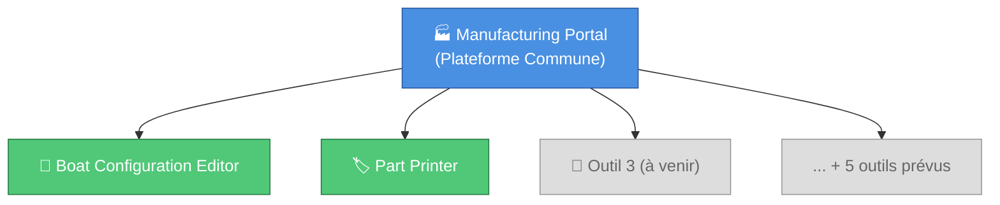
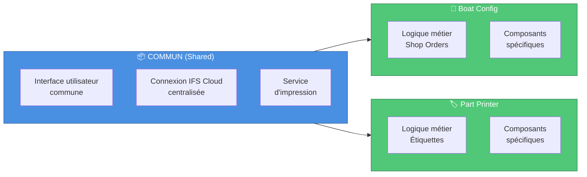
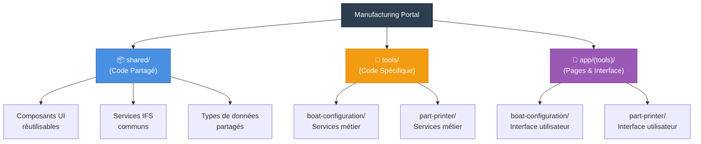
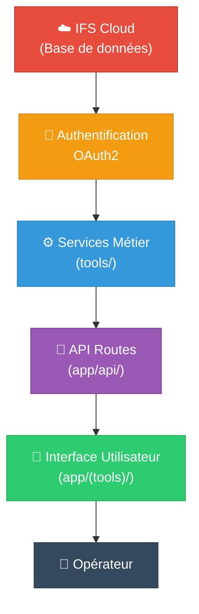
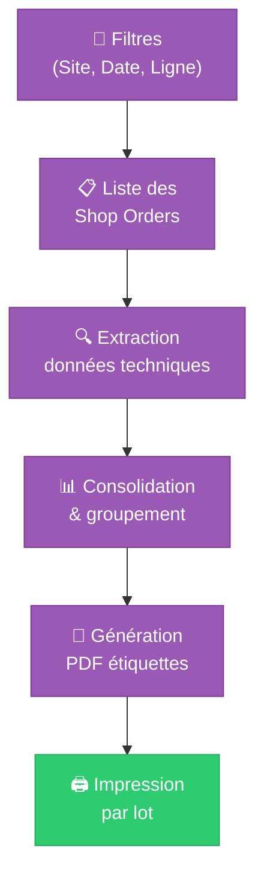
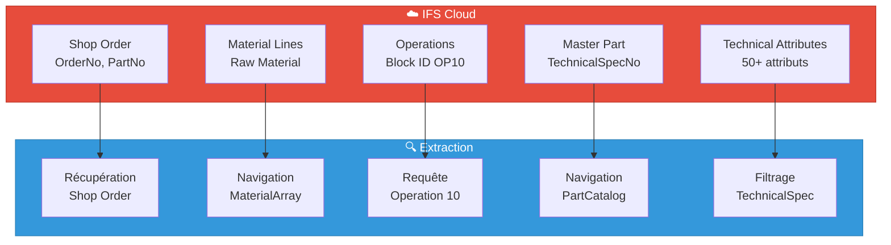
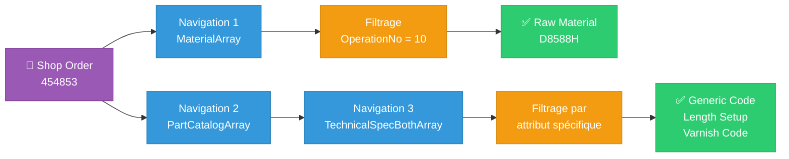
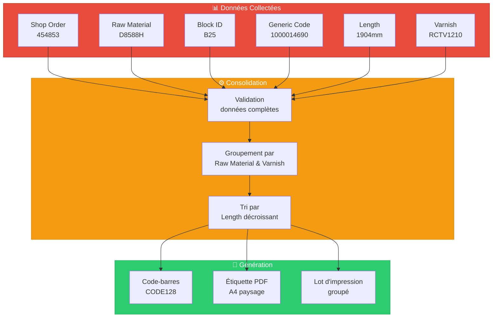
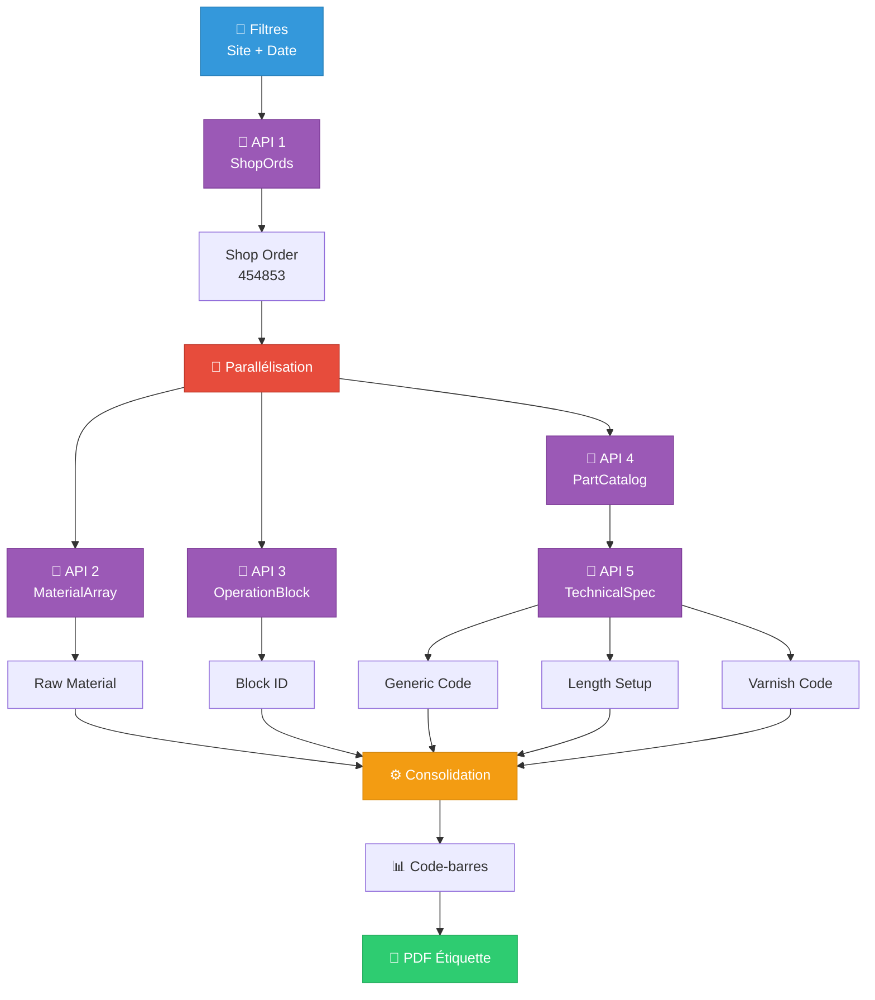
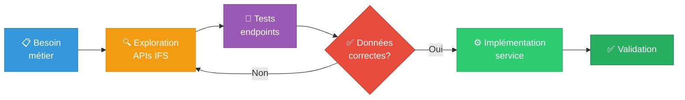

# Manufacturing Portal - Documentation Métier

**Version** : 1.0  
**Date** : 16 octobre 2025  
**Développé par** : Romain BOTTERO - Alternant Concepteur d'Application  
**Documentation antérieure** : Marc TOCQUARD - Chef de Projet Informatique

---

## Table des Matières

1. [Vue d'Ensemble du Portal](#1-vue-densemble-du-portal)
2. [Architecture & Organisation](#2-architecture--organisation)
3. [Les Outils & Workflows](#3-les-outils--workflows)

---

## 1. Vue d'Ensemble du Portal

### Contexte & Objectif

Le **Manufacturing Portal** est une plateforme web centralisée développée pour Bénéteau qui regroupe plusieurs outils de production. L'objectif est de **simplifier et standardiser** l'accès aux outils numériques utilisés sur les sites de production.

### Principe Fondamental

Au lieu de développer chaque outil de manière isolée, nous avons construit une **infrastructure commune** où chaque nouvel outil bénéficie automatiquement de composants, services et fonctionnalités partagés.



### État Actuel

| Outil | Statut | Déploiement |
|-------|--------|-------------|
| **Boat Configuration Editor** | 🧪 En phase de test | Novembre 2025 |
| **Part Printer** | 🧪 En phase de test | Novembre 2025 |
| **5+ outils futurs** | 📋 Planifié | 2026+ |

### Interface du Portal


*Page d'accueil centralisée donnant accès aux différents outils de production*

### Valeur Ajoutée

**Pour les opérateurs** :
- Interface unique et cohérente pour tous les outils
- Accès centralisé avec authentification unique (Azure AD)

**Pour l'entreprise** :
- Réduction des coûts de développement (réutilisation du code)
- Maintenance simplifiée (un seul codebase)
- Déploiement plus rapide de nouveaux outils
- Évolutivité garantie

---

## 2. Architecture & Organisation

### 2.1 Architecture Partagée vs Spécifique

Le Manufacturing Portal utilise une architecture **modulaire** qui sépare clairement ce qui est commun de ce qui est spécifique à chaque outil.



**Principe** : Tout ce qui est utilisé par au moins 2 outils est placé dans `shared/` (partagé). Ce qui est propre à un seul outil reste dans son dossier dédié.

### 2.2 Groupement de Routes (Route Grouping)

Le portal utilise une technique d'organisation appelée **route grouping** qui permet de structurer le code sans affecter les URLs visibles par les utilisateurs.

```
URL visible par l'utilisateur :
- https://portal.beneteau.com/boat-configuration
- https://portal.beneteau.com/part-printer

Organisation du code (invisible pour l'utilisateur) :
- src/app/(tools)/boat-configuration/
- src/app/(tools)/part-printer/
```

**Avantage** : Le dossier `(tools)` permet de regrouper tous les outils dans le code sans que cela n'apparaisse dans l'URL. Cela facilite la maintenance et la navigation dans le projet.

### 2.3 Structure du Code



**Organisation en 3 niveaux** :

1. **shared/** : Tout ce qui est réutilisable (boutons, connexion IFS, impression)
2. **tools/** : La logique métier propre à chaque outil (calculs, règles de gestion)
3. **app/(tools)/** : Les pages et l'interface visuelle de chaque outil

### 2.4 Flux de Données

Le schéma suivant montre comment les données circulent depuis IFS Cloud jusqu'à l'utilisateur :



**Principe de sécurité** : La connexion à IFS Cloud est centralisée et sécurisée. Chaque requête passe par une authentification OAuth2 avant d'accéder aux données.

---

## 3. Les Outils & Workflows

### 3.1 Boat Configuration Editor

#### Objectif Métier

Permettre aux opérateurs d'**imprimer rapidement** les documents de configuration des bateaux (formulaire MA_FO_CR_1419) en recherchant un Shop Order dans IFS Cloud.

#### Workflow Simplifié


#### Problème Résolu

**Avant** : L'opérateur devait naviguer dans plusieurs écrans IFS, noter manuellement le Serial Number, puis lancer l'impression.

**Après** : L'opérateur saisit uniquement le numéro de Shop Order. Le système récupère automatiquement toutes les informations nécessaires et imprime en un clic.

#### Statut

🧪 **En phase de test** - Déploiement prévu novembre 2025

#### Interface de l'Outil


*Interface de recherche et d'impression des configurations de bateaux*

---

### 3.2 Part Printer (Étiquettes Bois)

#### Objectif Métier

Automatiser l'**impression d'étiquettes** pour les pièces en bois en consolidant les informations provenant de plusieurs sources IFS Cloud (Shop Orders, opérations, caractéristiques techniques).

#### Workflow Simplifié



#### Complexité Technique

Cet outil nécessite d'interroger **5 endpoints différents** dans IFS Cloud pour consolider les informations d'une seule étiquette. Cette complexité a nécessité un **travail approfondi d'exploration et d'analyse** des APIs IFS Cloud.

##### Traitement Complexe des Données

**Étape 1 : Collecte Multi-Sources**



**Étape 2 : Navigation OData Multi-Niveaux**



**Étape 3 : Consolidation & Génération**



Cette architecture de traitement permet de **transformer des données complexes et éparpillées** en étiquettes prêtes à l'impression, tout en optimisant les performances grâce à des requêtes ciblées.

#### Types d'Étiquettes

1. **Débit classique** : Étiquettes pour les nouvelles pièces à débiter
2. **Redébit** : Étiquettes pour les pièces nécessitant un second débit

Chaque mode a ses propres règles métier qui sont automatiquement appliquées par l'outil.

#### Statut

🧪 **En phase de test** - Déploiement prévu novembre 2025

#### Interface de l'Outil


*Interface de filtrage et de génération d'étiquettes pour les pièces en bois*

---

### 3.3 Comparaison des Outils

| Aspect | Boat Configuration Editor | Part Printer |
|--------|---------------------------|--------------|
| **Complexité** | 🟢 Simple (3 étapes) | 🟠 Complexe (7 étapes) |
| **Sources IFS** | 2 endpoints | 5+ endpoints |
| **Volume** | 1 document à la fois | Batch (10-100 étiquettes) |
| **Utilisateurs** | Sites d'assemblage | Ateliers bois |

### 3.4 Traitement des Données : De l'API à l'Étiquette

Les deux outils illustrent différents niveaux de complexité dans le traitement des données IFS.

#### Boat Configuration Editor : Workflow Simple


**Principe** : Traitement linéaire avec 2 APIs en séquence.

#### Part Printer : Workflow Complexe



**Principe** : Traitement parallèle avec 5 APIs et consolidation finale.

**Différence clé** : Le Part Printer nécessite une orchestration complexe de multiples sources de données et une logique de consolidation avancée.

---

## Annexe : Méthodologie d'Exploration IFS Cloud

Le développement des outils a nécessité une **méthodologie rigoureuse** pour comprendre et exploiter les APIs IFS Cloud.

### Approche Itérative



### Techniques Utilisées

1. **Analyse des métadonnées OData** : Étude des `$metadata` pour comprendre la structure
2. **Navigation progressive** : Tests des relations entre entités (`NavigationProperty`)
3. **Optimisation des filtres** : Utilisation de `$filter`, `$select`, `$expand` pour limiter les données
4. **Documentation systématique** : Chaque découverte documentée pour référence future

### Exemple Concret : Extraction Raw Material

**Problème** : Aucun endpoint direct pour récupérer les matières premières d'une opération.

**Solution trouvée** :
- Navigation OData : `ShopOrds(...)/MaterialArray`
- Filtrage côté code pour isoler l'opération 10 (OP10)
- Résultat : Accès aux données sans endpoint dédié

Cette approche méthodique a permis de **surmonter les limitations** de la documentation IFS et d'exploiter pleinement les capacités de l'API OData.

---

## Conclusion

Le **Manufacturing Portal** représente une approche moderne et évolutive du développement d'outils de production. En mutualisant l'infrastructure commune et en standardisant l'architecture, nous garantissons :

✅ **Rapidité** : Développement accéléré des nouveaux outils  
✅ **Qualité** : Standards uniformes et code testé  
✅ **Évolutivité** : Architecture prête pour 10+ outils  
✅ **Maintenance** : Corrections et améliorations partagées  
✅ **Expérience utilisateur** : Interface cohérente et intuitive

---

**Développement**  
- **Romain BOTTERO** - Alternant Concepteur d'Application  

**Documentation & Support**  
- **Marc TOCQUARD** - Chef de Projet Informatique (Documentation antérieure)

**Date de mise à jour** : 16 octobre 2025  
**Version** : 1.0
