# Manufacturing Portal - Documentation Métier

**Version** : 1.0  
**Date** : 16 octobre 2025  
**Développé par** : Romain BOTTERO - Alternant Concepteur d'Application  
**Documentation antérieure** : Marc TOCQUARD - Chef de Projet Informatique

---

## Table des Matières

1. [Vue d'Ensemble du Portal](#1-vue-densemble-du-portal)
2. [Architecture & Organisation](#2-architecture--organisation)
3. [Les Outils & Workflows](#3-les-outils--workflows)

---

## 1. Vue d'Ensemble du Portal

### Contexte & Objectif

Le **Manufacturing Portal** est une plateforme web centralisée développée pour Bénéteau qui regroupe plusieurs outils de production. L'objectif est de **simplifier et standardiser** l'accès aux outils numériques utilisés sur les sites de production.

### Principe Fondamental

Au lieu de développer chaque outil de manière isolée, nous avons construit une **infrastructure commune** où chaque nouvel outil bénéficie automatiquement de composants, services et fonctionnalités partagés.

```mermaid
flowchart TB
    Portal["🏭 Manufacturing Portal<br/>(Plateforme Commune)"]
    
    Portal --> Tool1["🚢 Boat Configuration Editor"]
    Portal --> Tool2["🏷️ Part Printer"]
    Portal --> Tool3["🔧 Outil 3 (à venir)"]
    Portal --> ToolN["... + 5 outils prévus"]
    
    style Portal fill:#4a90e2,stroke:#2c5aa0,color:#fff
    style Tool1 fill:#50c878,stroke:#2d7a4a,color:#fff
    style Tool2 fill:#50c878,stroke:#2d7a4a,color:#fff
    style Tool3 fill:#ddd,stroke:#999,color:#666
    style ToolN fill:#ddd,stroke:#999,color:#666
```

### État Actuel

| Outil | Statut | Déploiement |
|-------|--------|-------------|
| **Boat Configuration Editor** | 🧪 En phase de test | Novembre 2025 |
| **Part Printer** | 🧪 En phase de test | Novembre 2025 |
| **5+ outils futurs** | 📋 Planifié | 2026+ |

### Interface du Portal

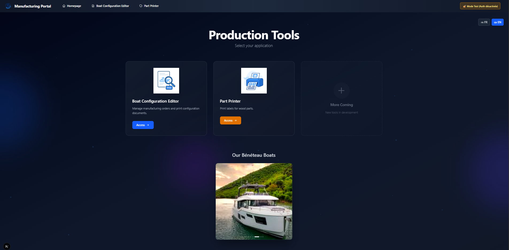
*Page d'accueil centralisée donnant accès aux différents outils de production*

### Valeur Ajoutée

**Pour les opérateurs** :
- Interface unique et cohérente pour tous les outils
- Accès centralisé avec authentification unique (Azure AD)

**Pour l'entreprise** :
- Réduction des coûts de développement (réutilisation du code)
- Maintenance simplifiée (un seul codebase)
- Déploiement plus rapide de nouveaux outils
- Évolutivité garantie

---

## 2. Architecture & Organisation

### 2.1 Architecture Partagée vs Spécifique

Le Manufacturing Portal utilise une architecture **modulaire** qui sépare clairement ce qui est commun de ce qui est spécifique à chaque outil.

```mermaid
flowchart LR
    subgraph Shared["📦 COMMUN (Shared)"]
        SharedUI["Interface utilisateur<br/>commune"]
        SharedAPI["Connexion IFS Cloud<br/>centralisée"]
        SharedPrint["Service<br/>d'impression"]
    end
    
    subgraph Tool1["🚢 Boat Config"]
        BC_Logic["Logique métier<br/>Shop Orders"]
        BC_UI["Composants<br/>spécifiques"]
    end
    
    subgraph Tool2["🏷️ Part Printer"]
        PP_Logic["Logique métier<br/>Étiquettes"]
        PP_UI["Composants<br/>spécifiques"]
    end
    
    Shared --> Tool1
    Shared --> Tool2
    
    style Shared fill:#4a90e2,stroke:#2c5aa0,color:#fff
    style Tool1 fill:#50c878,stroke:#2d7a4a,color:#fff
    style Tool2 fill:#50c878,stroke:#2d7a4a,color:#fff
```

**Principe** : Tout ce qui est utilisé par au moins 2 outils est placé dans `shared/` (partagé). Ce qui est propre à un seul outil reste dans son dossier dédié.

### 2.2 Groupement de Routes (Route Grouping)

Le portal utilise une technique d'organisation appelée **route grouping** qui permet de structurer le code sans affecter les URLs visibles par les utilisateurs.

```
URL visible par l'utilisateur :
- https://portal.beneteau.com/boat-configuration
- https://portal.beneteau.com/part-printer

Organisation du code (invisible pour l'utilisateur) :
- src/app/(tools)/boat-configuration/
- src/app/(tools)/part-printer/
```

**Avantage** : Le dossier `(tools)` permet de regrouper tous les outils dans le code sans que cela n'apparaisse dans l'URL. Cela facilite la maintenance et la navigation dans le projet.

### 2.3 Structure du Code

```mermaid
flowchart TD
    Root["Manufacturing Portal"]
    
    Root --> Shared["📦 shared/<br/>(Code Partagé)"]
    Root --> Tools["🔧 tools/<br/>(Code Spécifique)"]
    Root --> AppTools["🎨 app/(tools)/<br/>(Pages & Interface)"]
    
    Shared --> SharedComp["Composants UI<br/>réutilisables"]
    Shared --> SharedServ["Services IFS<br/>communs"]
    Shared --> SharedTypes["Types de données<br/>partagés"]
    
    Tools --> ToolBC["boat-configuration/<br/>Services métier"]
    Tools --> ToolPP["part-printer/<br/>Services métier"]
    
    AppTools --> PageBC["boat-configuration/<br/>Interface utilisateur"]
    AppTools --> PagePP["part-printer/<br/>Interface utilisateur"]
    
    style Root fill:#2c3e50,stroke:#1a252f,color:#fff
    style Shared fill:#4a90e2,stroke:#2c5aa0,color:#fff
    style Tools fill:#f39c12,stroke:#d68910,color:#fff
    style AppTools fill:#9b59b6,stroke:#7d3c98,color:#fff
```

**Organisation en 3 niveaux** :

1. **shared/** : Tout ce qui est réutilisable (boutons, connexion IFS, impression)
2. **tools/** : La logique métier propre à chaque outil (calculs, règles de gestion)
3. **app/(tools)/** : Les pages et l'interface visuelle de chaque outil

### 2.4 Flux de Données

Le schéma suivant montre comment les données circulent depuis IFS Cloud jusqu'à l'utilisateur :

```mermaid
flowchart TD
    IFS["☁️ IFS Cloud<br/>(Base de données)"]
    
    IFS --> Auth["🔐 Authentification<br/>OAuth2"]
    Auth --> Services["⚙️ Services Métier<br/>(tools/)"]
    Services --> API["🔌 API Routes<br/>(app/api/)"]
    API --> UI["🎨 Interface Utilisateur<br/>(app/(tools)/)"]
    UI --> User["👤 Opérateur"]
    
    style IFS fill:#e74c3c,stroke:#c0392b,color:#fff
    style Auth fill:#f39c12,stroke:#d68910,color:#fff
    style Services fill:#3498db,stroke:#2980b9,color:#fff
    style API fill:#9b59b6,stroke:#7d3c98,color:#fff
    style UI fill:#2ecc71,stroke:#27ae60,color:#fff
    style User fill:#34495e,stroke:#2c3e50,color:#fff
```

**Principe de sécurité** : La connexion à IFS Cloud est centralisée et sécurisée. Chaque requête passe par une authentification OAuth2 avant d'accéder aux données.

---

## 3. Les Outils & Workflows

### 3.1 Boat Configuration Editor

#### Objectif Métier

Permettre aux opérateurs d'**imprimer rapidement** les documents de configuration des bateaux (formulaire MA_FO_CR_1419) en recherchant un Shop Order dans IFS Cloud.

#### Workflow Simplifié


#### Problème Résolu

**Avant** : L'opérateur devait naviguer dans plusieurs écrans IFS, noter manuellement le Serial Number, puis lancer l'impression.

**Après** : L'opérateur saisit uniquement le numéro de Shop Order. Le système récupère automatiquement toutes les informations nécessaires et imprime en un clic.

#### Statut

🧪 **En phase de test** - Déploiement prévu novembre 2025

#### Interface de l'Outil

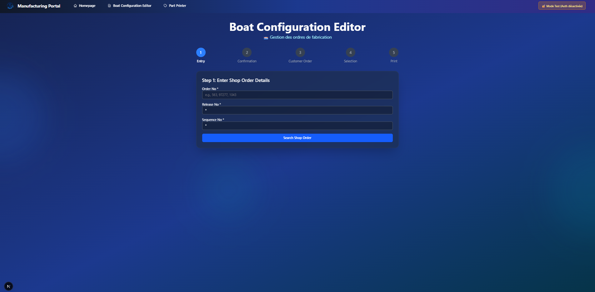
*Interface de recherche et d'impression des configurations de bateaux*

---

### 3.2 Part Printer (Étiquettes Bois)

#### Objectif Métier

Automatiser l'**impression d'étiquettes** pour les pièces en bois en consolidant les informations provenant de plusieurs sources IFS Cloud (Shop Orders, opérations, caractéristiques techniques).

#### Workflow Simplifié

```mermaid
flowchart TD
    A["🔎 Filtres<br/>(Site, Date, Ligne)"] --> B["📋 Liste des<br/>Shop Orders"]
    B --> C["🔍 Extraction<br/>données techniques"]
    C --> D["📊 Consolidation<br/>& groupement"]
    D --> E["📄 Génération<br/>PDF étiquettes"]
    E --> F["🖨️ Impression<br/>par lot"]
    
    style A fill:#9b59b6,stroke:#7d3c98,color:#fff
    style B fill:#9b59b6,stroke:#7d3c98,color:#fff
    style C fill:#9b59b6,stroke:#7d3c98,color:#fff
    style D fill:#9b59b6,stroke:#7d3c98,color:#fff
    style E fill:#9b59b6,stroke:#7d3c98,color:#fff
    style F fill:#2ecc71,stroke:#27ae60,color:#fff
```

#### Complexité Technique

Cet outil nécessite d'interroger **5 endpoints différents** dans IFS Cloud pour consolider les informations d'une seule étiquette. Cette complexité a nécessité un **travail approfondi d'exploration et d'analyse** des APIs IFS Cloud.

##### Traitement Complexe des Données

**Étape 1 : Collecte Multi-Sources**

```mermaid
flowchart TB
    subgraph IFS["☁️ IFS Cloud"]
        SO["Shop Order<br/>OrderNo, PartNo"]
        MAT["Material Lines<br/>Raw Material"]
        OP["Operations<br/>Block ID OP10"]
        PART["Master Part<br/>TechnicalSpecNo"]
        ATTR["Technical Attributes<br/>50+ attributs"]
    end
    
    subgraph Extraction["🔍 Extraction"]
        E1["Récupération<br/>Shop Order"]
        E2["Navigation<br/>MaterialArray"]
        E3["Requête<br/>Operation 10"]
        E4["Navigation<br/>PartCatalog"]
        E5["Filtrage<br/>TechnicalSpec"]
    end
    
    SO --> E1
    MAT --> E2
    OP --> E3
    PART --> E4
    ATTR --> E5
    
    style IFS fill:#e74c3c,stroke:#c0392b,color:#fff
    style Extraction fill:#3498db,stroke:#2980b9,color:#fff
```

**Étape 2 : Navigation OData Multi-Niveaux**

```mermaid
flowchart LR
    Start["🎯 Shop Order<br/>454853"] --> Nav1["Navigation 1<br/>MaterialArray"]
    Nav1 --> Filter1["Filtrage<br/>OperationNo = 10"]
    Filter1 --> Result1["✅ Raw Material<br/>D8588H"]
    
    Start --> Nav2["Navigation 2<br/>PartCatalogArray"]
    Nav2 --> Nav3["Navigation 3<br/>TechnicalSpecBothArray"]
    Nav3 --> Filter2["Filtrage par<br/>attribut spécifique"]
    Filter2 --> Result2["✅ Generic Code<br/>Length Setup<br/>Varnish Code"]
    
    style Start fill:#9b59b6,stroke:#7d3c98,color:#fff
    style Nav1 fill:#3498db,stroke:#2980b9,color:#fff
    style Nav2 fill:#3498db,stroke:#2980b9,color:#fff
    style Nav3 fill:#3498db,stroke:#2980b9,color:#fff
    style Filter1 fill:#f39c12,stroke:#d68910,color:#fff
    style Filter2 fill:#f39c12,stroke:#d68910,color:#fff
    style Result1 fill:#2ecc71,stroke:#27ae60,color:#fff
    style Result2 fill:#2ecc71,stroke:#27ae60,color:#fff
```

**Étape 3 : Consolidation & Génération**

```mermaid
flowchart TD
    subgraph Sources["📊 Données Collectées"]
        D1["Shop Order<br/>454853"]
        D2["Raw Material<br/>D8588H"]
        D3["Block ID<br/>B25"]
        D4["Generic Code<br/>1000014690"]
        D5["Length<br/>1904mm"]
        D6["Varnish<br/>RCTV1210"]
    end
    
    subgraph Consolidation["⚙️ Consolidation"]
        C1["Validation<br/>données complètes"]
        C2["Groupement par<br/>Raw Material & Varnish"]
        C3["Tri par<br/>Length décroissant"]
    end
    
    subgraph Output["📄 Génération"]
        O1["Code-barres<br/>CODE128"]
        O2["Étiquette PDF<br/>A4 paysage"]
        O3["Lot d'impression<br/>groupé"]
    end
    
    D1 & D2 & D3 & D4 & D5 & D6 --> C1
    C1 --> C2
    C2 --> C3
    C3 --> O1 & O2 & O3
    
    style Sources fill:#e74c3c,stroke:#c0392b,color:#fff
    style Consolidation fill:#f39c12,stroke:#d68910,color:#fff
    style Output fill:#2ecc71,stroke:#27ae60,color:#fff
```

Cette architecture de traitement permet de **transformer des données complexes et éparpillées** en étiquettes prêtes à l'impression, tout en optimisant les performances grâce à des requêtes ciblées.

#### Types d'Étiquettes

1. **Débit classique** : Étiquettes pour les nouvelles pièces à débiter
2. **Redébit** : Étiquettes pour les pièces nécessitant un second débit

Chaque mode a ses propres règles métier qui sont automatiquement appliquées par l'outil.

#### Statut

🧪 **En phase de test** - Déploiement prévu novembre 2025

#### Interface de l'Outil

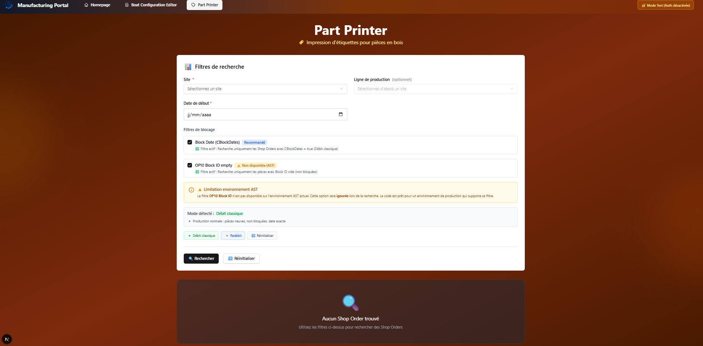
*Interface de filtrage et de génération d'étiquettes pour les pièces en bois*

---

### 3.3 Comparaison des Outils

| Aspect | Boat Configuration Editor | Part Printer |
|--------|---------------------------|--------------|
| **Complexité** | 🟢 Simple (3 étapes) | 🟠 Complexe (7 étapes) |
| **Sources IFS** | 2 endpoints | 5+ endpoints |
| **Volume** | 1 document à la fois | Batch (10-100 étiquettes) |
| **Utilisateurs** | Sites d'assemblage | Ateliers bois |

### 3.4 Traitement des Données : De l'API à l'Étiquette

Les deux outils illustrent différents niveaux de complexité dans le traitement des données IFS.

#### Boat Configuration Editor : Workflow Simple


**Principe** : Traitement linéaire avec 2 APIs en séquence.

#### Part Printer : Workflow Complexe

```mermaid
flowchart TD
    Input["📝 Filtres<br/>Site + Date"] --> API1["🔌 API 1<br/>ShopOrds"]
    API1 --> SO["Shop Order<br/>454853"]
    
    SO --> Branch1["🔀 Parallélisation"]
    
    Branch1 --> API2["🔌 API 2<br/>MaterialArray"]
    Branch1 --> API3["🔌 API 3<br/>OperationBlock"]
    Branch1 --> API4["🔌 API 4<br/>PartCatalog"]
    
    API2 --> D1["Raw Material"]
    API3 --> D2["Block ID"]
    API4 --> API5["🔌 API 5<br/>TechnicalSpec"]
    
    API5 --> D3["Generic Code"]
    API5 --> D4["Length Setup"]
    API5 --> D5["Varnish Code"]
    
    D1 & D2 & D3 & D4 & D5 --> Merge["⚙️ Consolidation"]
    Merge --> Barcode["📊 Code-barres"]
    Barcode --> PDF["📄 PDF Étiquette"]
    
    style Input fill:#3498db,stroke:#2980b9,color:#fff
    style API1 fill:#9b59b6,stroke:#7d3c98,color:#fff
    style API2 fill:#9b59b6,stroke:#7d3c98,color:#fff
    style API3 fill:#9b59b6,stroke:#7d3c98,color:#fff
    style API4 fill:#9b59b6,stroke:#7d3c98,color:#fff
    style API5 fill:#9b59b6,stroke:#7d3c98,color:#fff
    style Branch1 fill:#e74c3c,stroke:#c0392b,color:#fff
    style Merge fill:#f39c12,stroke:#d68910,color:#fff
    style PDF fill:#2ecc71,stroke:#27ae60,color:#fff
```

**Principe** : Traitement parallèle avec 5 APIs et consolidation finale.

**Différence clé** : Le Part Printer nécessite une orchestration complexe de multiples sources de données et une logique de consolidation avancée.

---

## Annexe : Méthodologie d'Exploration IFS Cloud

Le développement des outils a nécessité une **méthodologie rigoureuse** pour comprendre et exploiter les APIs IFS Cloud.

### Approche Itérative

```mermaid
flowchart LR
    A["📋 Besoin<br/>métier"] --> B["🔍 Exploration<br/>APIs IFS"]
    B --> C["🧪 Tests<br/>endpoints"]
    C --> D{"✅ Données<br/>correctes?"}
    D -->|Non| B
    D -->|Oui| E["⚙️ Implémentation<br/>service"]
    E --> F["✅ Validation"]
    
    style A fill:#3498db,stroke:#2980b9,color:#fff
    style B fill:#f39c12,stroke:#d68910,color:#fff
    style C fill:#9b59b6,stroke:#7d3c98,color:#fff
    style D fill:#e74c3c,stroke:#c0392b,color:#fff
    style E fill:#2ecc71,stroke:#27ae60,color:#fff
    style F fill:#27ae60,stroke:#1e8449,color:#fff
```

### Techniques Utilisées

1. **Analyse des métadonnées OData** : Étude des `$metadata` pour comprendre la structure
2. **Navigation progressive** : Tests des relations entre entités (`NavigationProperty`)
3. **Optimisation des filtres** : Utilisation de `$filter`, `$select`, `$expand` pour limiter les données
4. **Documentation systématique** : Chaque découverte documentée pour référence future

### Exemple Concret : Extraction Raw Material

**Problème** : Aucun endpoint direct pour récupérer les matières premières d'une opération.

**Solution trouvée** :
- Navigation OData : `ShopOrds(...)/MaterialArray`
- Filtrage côté code pour isoler l'opération 10 (OP10)
- Résultat : Accès aux données sans endpoint dédié

Cette approche méthodique a permis de **surmonter les limitations** de la documentation IFS et d'exploiter pleinement les capacités de l'API OData.

---

## Conclusion

Le **Manufacturing Portal** représente une approche moderne et évolutive du développement d'outils de production. En mutualisant l'infrastructure commune et en standardisant l'architecture, nous garantissons :

✅ **Rapidité** : Développement accéléré des nouveaux outils  
✅ **Qualité** : Standards uniformes et code testé  
✅ **Évolutivité** : Architecture prête pour 10+ outils  
✅ **Maintenance** : Corrections et améliorations partagées  
✅ **Expérience utilisateur** : Interface cohérente et intuitive

---

**Développement**  
- **Romain BOTTERO** - Alternant Concepteur d'Application  

**Documentation & Support**  
- **Marc TOCQUARD** - Chef de Projet Informatique (Documentation antérieure)

**Date de mise à jour** : 16 octobre 2025  
**Version** : 1.0
