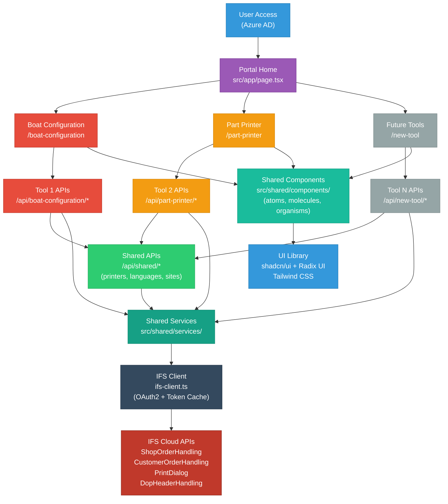
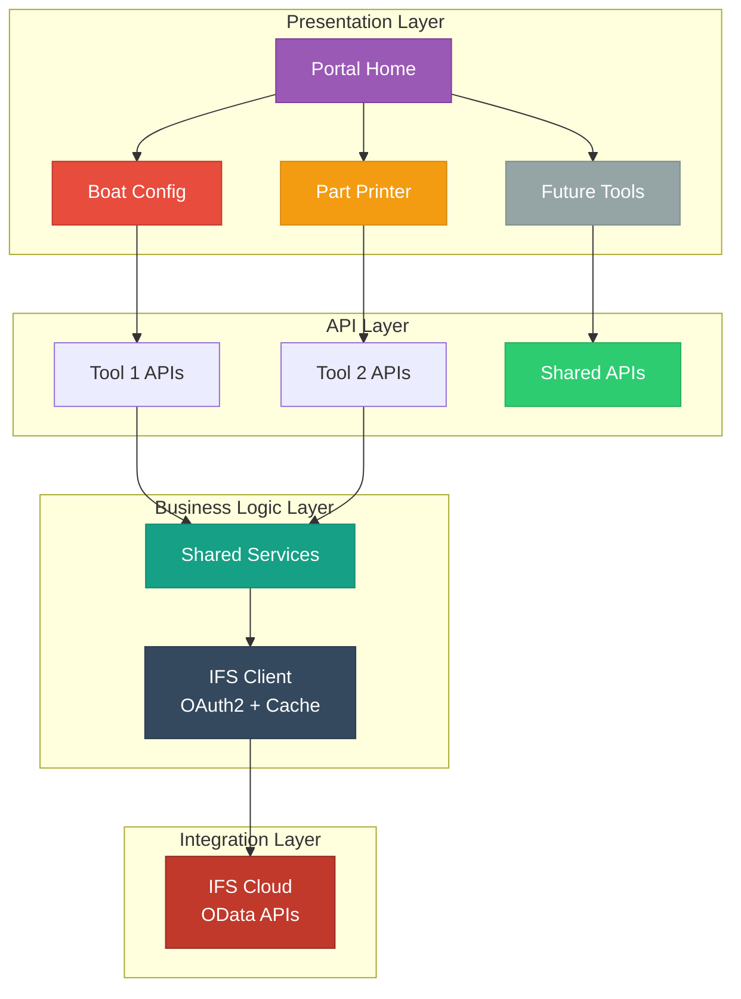
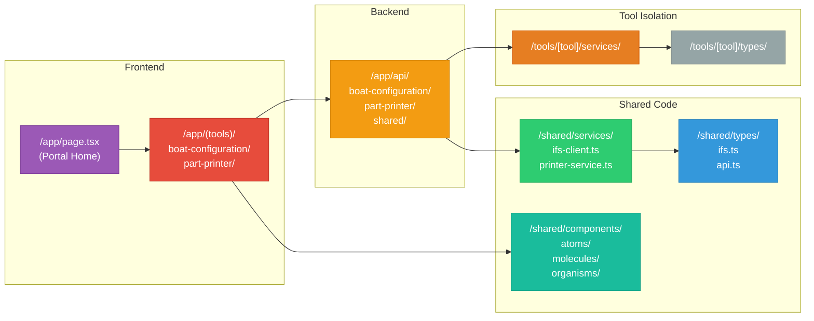

# Mermaid Diagram - Manufacturing Portal Architecture

**Instructions**: Copy this code to Mermaid Live Editor (https://mermaid.live) to generate the diagram, then export as PNG/SVG and insert into Word.

## Alternative: Simplified Layered Architecture

## Alternative: File Structure Diagram

## How to Insert in Word

1. Open https://mermaid.live
2. Copy-paste one of the Mermaid codes above (choose the one you prefer)
3. Click "Export" → "PNG" or "SVG"
4. Download the image
5. In Word Online: Insert → Images → Upload from this device
6. Position the image in the document where needed

## Diagram Choices

**Main Flow Diagram**: Shows complete data flow from user to IFS Cloud  
**Layered Architecture**: Shows architectural layers (Presentation, API, Business Logic, Integration)  
**File Structure**: Shows actual code organization and folder structure
