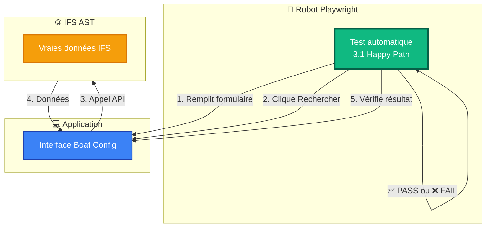

# 🎯 Tests E2E Playwright - Découverte pour les Équipes Métier

**Objectif** : Découvrir comment fonctionnent les tests automatisés et ce qu'ils peuvent apporter

**Audience** : Équipes de test métier / Utilisateurs finaux

**Durée** : 15-20 minutes

---

## 📋 Plan de la présentation

1. [Qu'est-ce que Playwright ?](#1-quest-ce-que-playwright)
2. [Démo live : Voir les tests en action](#2-démo-live--voir-les-tests-en-action)
3. [Ce que ça peut remplacer](#3-ce-que-ça-peut-remplacer)
4. [Discussion et questions](#4-discussion-et-questions)

---

## 1. Qu'est-ce que Playwright ?

### 🤖 Définition simple

**Playwright** : Un outil qui pilote automatiquement un navigateur web, comme si un utilisateur cliquait et tapait.

**Ce qu'il fait** :
- Ouvre un navigateur (Chrome, Firefox, Safari)
- Remplit des formulaires
- Clique sur des boutons
- Vérifie que les bonnes données apparaissent
- Génère un rapport avec screenshots et vidéos

**Ce qu'il ne fait PAS** :
- Remplacer la réflexion humaine
- Tester l'ergonomie ou l'esthétique
- Trouver des bugs auxquels on n'a pas pensé

---

## 2. Comment ça fonctionne ?

### 🏗️ Architecture des tests



**Point important** : Les tests utilisent les **vraies APIs IFS** (pas de simulation)

---

## 3. Démo live : Voir les tests en action

### 🎬 Démo 1 : Test Happy Path (3.1)

**Ce que vous allez voir** :
1. Navigateur Chrome s'ouvre automatiquement
2. Page Boat Configuration se charge
3. Robot remplit "Order No: 100563"
4. Robot clique "Rechercher"
5. Serial Number apparaît
6. Robot clique "Oui, Continuer"
7. Customer Order se charge
8. Robot sélectionne langue
9. Robot clique "Continuer"
10. Page Print s'affiche → **✅ TEST PASS**

**Durée mesurée** : 14 secondes

**Commande** :
```bash
pnpm exec playwright test workflows/happy-path.spec.ts:55 --ui
```

---

### 🎬 Démo 2 : Test Shop Order inexistant (3.3)

**Ce que vous allez voir** :
1. Robot saisit Shop Order "999999" (inexistant)
2. Robot clique "Rechercher"
3. Message d'erreur apparaît
4. Robot vérifie que l'erreur est bien affichée → **✅ TEST PASS**
5. Robot re-teste avec Shop Order valide
6. Cette fois ça marche → **✅ TEST PASS**

**Durée mesurée** : 8 secondes

**Ce que ça teste** :
- Gestion d'erreur
- Message utilisateur
- Possibilité de retry

---

### 🎬 Démo 3 : Test Multiple Shop Orders (3.5)

**Ce que vous allez voir** :
1. Robot teste 3 Shop Orders différents
2. Robot clique "Recommencer" entre chacun
3. Vérification qu'il n'y a pas d'interférence

**Durée mesurée** : 22 secondes pour 3 Shop Orders

---

### 📸 Ce que Playwright génère automatiquement

1. **Screenshots** : Captures d'écran de chaque étape
2. **Vidéos** : Enregistrement complet du test
3. **Logs détaillés** : Chaque action et vérification tracée

---

## 4. Ce que ça peut tester

### ✅ Tests actuellement implémentés (16 tests)

**Niveau 1 - Health Checks** ✅ **4/4 PASS**
- Application accessible
- API Routes fonctionnelles
- Connexion IFS réussie
- Services IFS disponibles

**Niveau 2 - API Unit Tests** ✅ **4/7 PASS** (3 endpoints à investiguer)
- Recherche Shop Order
- Liste imprimantes
- Liste langues

**Niveau 3 - Workflow Tests** ✅ **5/5 PASS**
- Happy Path complet (14s)
- Navigation entre étapes (13s)
- Shop Order not found (8s)
- Bouton "Recommencer" (8s)
- Multiple Shop Orders (22s)

---

### 🚀 Tests à venir

**Niveau 4 - Business Validation** (5 tests prévus)
- Comparaison données avec IFS
- Vérification de tous les champs affichés

**Niveau 5 - Performance Tests** (5 tests prévus)
- Temps de réponse
- Gestion erreurs réseau
- Utilisateurs simultanés

**Niveau 6 - Cross-browser Tests** (4 tests prévus)
- Chrome, Firefox, Safari
- Mobile (iPad, iPhone)

---

## 5. Discussion et questions

### Ce qu'on peut faire ensemble

1. **Identifier les cas de test prioritaires**
   > Quels tests manuels faites-vous régulièrement ?

2. **Partager vos cas particuliers**
   > Quels bugs avez-vous déjà rencontrés ?

3. **Proposer de nouveaux tests**
   > Qu'est-ce qui serait utile à automatiser ?

---

### Comment lancer les tests

```bash
# Tous les tests
pnpm exec playwright test workflows/

# Un test spécifique
pnpm exec playwright test workflows/happy-path.spec.ts

# Mode visuel (recommandé)
pnpm exec playwright test workflows/ --ui
```

---

### Questions ouvertes

**Q : Et si le test dit PASS mais il y a quand même un bug ?**

R : Les tests automatisés testent ce qu'on leur dit de tester. Si vous trouvez un cas non couvert, on peut ajouter un nouveau test pour ce cas.

---

**Q : Et si IFS change une API ?**

R : Le test échouera, ce qui nous alertera immédiatement du problème. On pourra alors adapter le test ou corriger le code.

---

**Q : Peut-on tester sur de vraies données de production ?**

R : Actuellement les tests utilisent l'environnement AST (développement). Pour la production, mieux vaut utiliser du monitoring plutôt que des tests automatisés (risque de modifier des données réelles).
