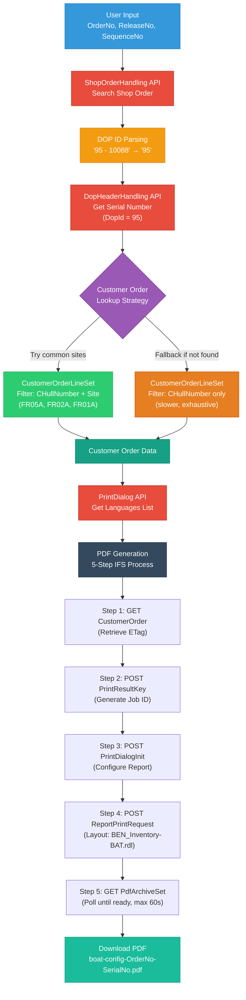

# Mermaid Diagram - Boat Configuration Editor Data Flow

**Instructions**: Copy this code to Mermaid Live Editor (https://mermaid.live) to generate the diagram, then export as PNG/SVG and insert into Word.

## Alternative: Direct Mermaid Live Link

https://mermaid.live/edit#pako:eNqVVE1vozAQ_SuWTz1UCIQ0CZfVSqtWu1LVSqsePFmDhGxsZEOyivLfO4aQkLbdXvZk2zPz3puZN2cWqRQsYoFgMpNcJowXUIrCKEpBK8VJBRtQZV6CUlyA1krBVq2USsBKKVhpBVulYGslYG0l4OAk4HAtIdypZbzSCo5KwdEpOCoFx1bBSin4pBV8UgrOWsG51XDWGs5aw7nVcNYazq2Gs9Zwbg2ctYaz1XC2Gs5Ww9lqOFsNZ6vhbDWcrYaz1XC2Gs5Ww9lqOFsNZ6vhbDWcrYZza+HcWji3Fs6thXNr4dxaOLcWzq2Fc2vh3Fo4txbOrYVza-HcWji3Fs6thXNr4dxaOLcWzq2Fc2vh3Fo4txbOrYVzZ-HcWTh3Fs6dhXNn4dxZOHcWzp2Fc2fh3Fk4dxbOnYVzZ-HcWTh3Fs6dhXNn4dxZOHcWzp2Fc2fh3Fk4dxbOnYVzZ-HcWTh3Ds6dg3Pn4Nw5OHcOzp2Dc-fg3Dk4dw7OnYNz5-DcOTh3Ds6dg3Pn4Nw5OHcOzp2Dc-fg3Dk4dw7OnYNz5-DcOTh3Ds6dg3Pn4Nw5OHcOzp2Dc-fg3Dk4dw7OnYNz5-DcOTh3Ds6dg3Pn4Nw5OHcOzp2Dc-fg3Dk4dw7OnYNz5-DcOTh3Ds6dg3Pn4Nw5OHcOzp2Dc-fg3Dk4dw7OnYNz5-DcOTh3Ds6dg3Pn4Nw5OHcOzp2Dc-fg3Dk4d

## How to Insert in Word

1. Open https://mermaid.live
2. Copy-paste the Mermaid code above
3. Click "Export" → "PNG" or "SVG"
4. Download the image
5. In Word Online: Insert → Images → Upload from this device
6. Position the image in the document where needed
