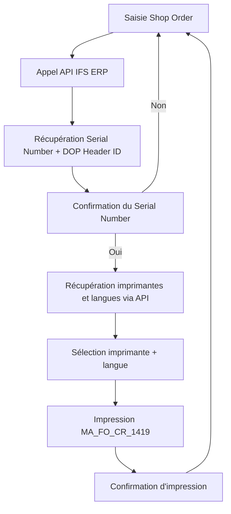

# Boat Configuration Editor – Spécification Fonctionnelle

**Auteur:** Marc Toquard (Groupe Bénéteau)  
**Version:** 0.2  
**Date:** 25/09/2025

---

## 📋 Table des matières

1. [Objectif du projet](#objectif-du-projet)
2. [Périmètre](#périmètre)
3. [Processus métier](#processus-métier)
4. [Règles métiers](#règles-métiers)
5. [Critères d'acceptation](#critères-dacceptation)
6. [Interfaces utilisateur](#interfaces-utilisateur)
7. [Architecture fonctionnelle](#architecture-fonctionnelle)
8. [Composants fonctionnels IFS](#composants-fonctionnels-ifs)
9. [Spécifications techniques](#spécifications-techniques)
10. [APIs](#apis)
11. [Historique du document](#historique-du-document)

---

## 🎯 Objectif du projet

Créer une **application simple** permettant à un utilisateur de :

1. ✅ Identifier le **Serial Number** et le **DOP Header** à partir d'un **Shop Order**
2. ✅ Vérifier et confirmer le numéro de série affiché
3. ✅ Sélectionner une **imprimante** et une **langue**
4. ✅ Lancer l'impression du document **MA_FO_CR_1419** lié à la commande client

### 📚 Références internes

- [Business Requirements](https://beneteaugroup.sharepoint.com/:p:/s/STARBOARD/Ef1_1PTiQeNNmhGRhJAh728BhODF3KDuwOs2VTFs6TdV4g?e=ROu0kn)
- [Business Specifications](https://beneteaugroup.sharepoint.com/:p:/s/STARBOARD/EYmWDRzERztBoM5q1QjH5RsBgL0rxH18rgZ3gGQqMo3aTA?e=QhXkBG)

---

## 🔍 Périmètre

### Utilisateurs cibles
- **GAP Leaders**
- **Superviseurs**
- **Quality Controllers**

### Contraintes techniques
- ✅ Interaction **uniquement via API** (Azure API Management - APIM)
- ✅ Accès restreint via [Data Privilege](https://dataprivilege.domain.group/DP)
- ✅ Gestion des groupes d'utilisateurs par l'IT Bénéteau
- ✅ Interface en **anglais uniquement**

### Clés d'identification d'un Shop Order
L'utilisateur saisit **3 clés obligatoires** :
1. **Order No** (20 caractères)
2. **Release No** (10 caractères)
3. **Sequence No** (10 caractères)

---

## 🔄 Processus métier

### Workflow principal



### Étapes détaillées

1. **Saisie** des 3 clés du Shop Order
2. **Recherche** via API → récupération du Serial Number et DOP Header ID
3. **Confirmation** par l'utilisateur du numéro de série
4. **Récupération** des imprimantes et langues disponibles
5. **Sélection** par l'utilisateur
6. **Lancement** de l'impression du document MA_FO_CR_1419
7. **Confirmation** de succès

---

## ⚙️ Règles métiers

### Règles de validation

| Règle | Description |
|-------|-------------|
| **RG-001** | Les 3 clés doivent correspondre à un **Shop Order unique** dans IFS ERP |
| **RG-002** | La **confirmation du Serial Number** est obligatoire avant de continuer |
| **RG-003** | La sélection de **l'imprimante** est obligatoire |
| **RG-004** | La sélection de **la langue** est obligatoire |
| **RG-005** | Le document imprimé est **toujours MA_FO_CR_1419** |
| **RG-006** | L'interface est en **anglais uniquement** |
| **RG-007** | Accès restreint géré via **Data Privilege** |
| **RG-008** | Toutes les interactions passent par des **API Azure APIM** |

### Environnements

| Environnement | URL IFS | Usage |
|---------------|---------|-------|
| **DEV** | [beneteau-group-ast.ifs.cloud](https://beneteau-group-ast.ifs.cloud/landing-page/) | Développement |
| **PPD** | [beneteau-group-acc.ifs.cloud](https://beneteau-group-acc.ifs.cloud/landing-page/) | Pré-production |
| **PRD** | [beneteau-group.ifs.cloud](https://beneteau-group.ifs.cloud/landing-page/) | Production |

---

## ✅ Critères d'acceptation

- ✅ **CA-001:** Les utilisateurs autorisés peuvent rechercher un Serial Number et un DOP Header via API
- ✅ **CA-002:** Le workflow complet fonctionne de bout en bout (saisie → confirmation → sélection → impression)
- ✅ **CA-003:** Les profils non autorisés sont bloqués
- ✅ **CA-004:** Les messages d'erreur sont clairs et compréhensibles
- ✅ **CA-005:** Les messages de confirmation sont explicites
- ✅ **CA-006:** L'impression est lancée avec les paramètres corrects

---

## 🖥️ Interfaces utilisateur

### 📱 Écran 1 – Shop Order Entry

**Objectif:** Saisie des clés du Shop Order

#### Éléments d'interface

| Champ | Type | Obligatoire | Longueur max | Validation |
|-------|------|-------------|--------------|------------|
| **Order No** | Input text | ✅ | 20 caractères | Alphanumeric |
| **Release No** | Input text | ✅ | 10 caractères | Alphanumeric |
| **Sequence No** | Input text | ✅ | 10 caractères | Alphanumeric |

#### Actions
- **Bouton "Search"**: Appelle l'API pour rechercher le Shop Order
  - Si trouvé → Écran 2
  - Si non trouvé → Message d'erreur

#### Messages d'erreur possibles
- "Shop Order not found"
- "Invalid Shop Order format"
- "API connection error"

---

### 📱 Écran 2 – Serial Number Confirmation

**Objectif:** Confirmation du Serial Number trouvé

#### Éléments affichés

| Champ | Exemple | Source |
|-------|---------|--------|
| **Serial Number** | LG5XA0003 | API IFS ERP |
| **DOP Header ID** | 37 | API IFS ERP |

#### Question affichée
**"Is this Serial Number correct?"**

#### Actions
- **Bouton "Yes"**: Continue vers Écran 3
- **Bouton "No"**: Retour à Écran 1

---

### 📱 Écran 3 – Printer & Language Selection

**Objectif:** Sélection de l'imprimante et de la langue

#### Éléments d'interface

| Champ | Type | Source API | Obligatoire |
|-------|------|------------|-------------|
| **Printer** | Dropdown | `GET /printers` | ✅ |
| **Language** | Dropdown | `GET /languages` | ✅ |

#### Actions
- **Bouton "Print Document MA_FO_CR_1419"**: 
  - Appelle `POST /print`
  - Passe à Écran 4

#### Validation
- Les deux champs doivent être sélectionnés avant d'activer le bouton

---

### 📱 Écran 4 – Print Confirmation

**Objectif:** Confirmation du lancement de l'impression

#### Message affiché
✅ **"Print job started successfully"**

#### Actions
- **Bouton "New Print"**: Retour à Écran 1 pour une nouvelle impression

---

## 🏗️ Architecture fonctionnelle

### Diagramme
**Nom du fichier:** `BoatConfigEditor - Architecture.drawio`

### Flux de données

```
[User Interface] 
    ↓
[Azure APIM]
    ↓
[IFS ERP - Environment Specific]
    ├── DEV → IFS AST
    ├── PPD → IFS ACC
    └── PRD → IFS Cloud Production
```

### Composants

1. **Frontend Application**
   - Interface utilisateur (4 écrans)
   - Validation côté client
   - Appels API via Azure APIM

2. **Azure API Management (APIM)**
   - Authentification
   - Gestion des accès
   - Routage vers IFS ERP

3. **IFS ERP Backend**
   - Shop Order Management
   - DOP Header Management
   - Customer Order Management
   - Print Management

---

## 🧩 Composants fonctionnels IFS

### ✅ Services IFS validés (09/10/2025)

**Service Shop Order :** `ShopOrderHandling.svc` ✅  
**Service DOP :** `DopHeaderHandling.svc` ✅ (Important: pas `DopOrderHandling`)  
**Authentification :** OAuth2 avec realm `beneast1` ✅

---

### A. Shop Order → DOP Header ID

**Service OData :** `ShopOrderHandling.svc/ShopOrds`

**Requête exemple :**
```
GET /ShopOrderHandling.svc/ShopOrds?$filter=contains(OrderNo,'631')
```

**Champs retournés :**
- `DopId` : Identifiant DOP (peut être composé : "37 - 2")
- `DopDemandExists` : "TRUE" ou "FALSE"
- `PartNo` : Numéro de pièce
- `OrderNo`, `ReleaseNo`, `SequenceNo` : Clés du Shop Order

**Note importante :** ~5-10% des Shop Orders ont un DopId renseigné. Toujours vérifier `DopDemandExists = "TRUE"`.

---

### B. DOP Header → Serial Number

**Service OData :** `DopHeaderHandling.svc/Reference_DopHeadSerialReserv`

**Requête exemple :**
```
GET /DopHeaderHandling.svc/Reference_DopHeadSerialReserv?$filter=contains(DopId,'37')
```

**Champs retournés :**
- `SerialNo` : Numéro de série (ex: "JY6MB0019")
- `PartNo` : Numéro de pièce
- `ConditionCode` : Code condition
- `DopId` : Référence au DOP Header

**Gestion des cas particuliers :**
- **Multiple Serial Numbers :** Prendre le premier ou proposer une sélection
- **Aucun Serial Number :** Retourner null (mode dégradé)
- **DopId composé :** Extraire le numéro principal (ex: "37 - 2" → "37")

---

### C. Get Customer Order Line

Critères de recherche:
- **Hull Number** = Serial Number
- **Site** = FR05A
- **Order Type** = BAT

Table IFS: `CUSTOMER_ORDER_LINE_TAB`

---

### D. Get Customer Order

- Récupération de la commande client associée
- Table IFS: `CUSTOMER_ORDER_TAB`

---

### E. Print Report MA_FO_CR_1419

- Génération et impression du rapport
- Module IFS: Print Management

---

### F. Basic Data Reference

- Référentiels de base IFS
- Imprimantes disponibles
- Langues disponibles

---

### 📋 Endpoints IFS validés

| Service | Endpoint | Status | Usage |
|---------|----------|--------|-------|
| **ShopOrderHandling** | `/ShopOrds` | ✅ | Recherche Shop Orders |
| **DopHeaderHandling** | `/DopHeadSet` | ✅ | Récupération DOP Headers |
| **DopHeaderHandling** | `/Reference_DopHeadSerialReserv` | ✅ | Serial Numbers réservés |
| **DopHeaderHandling** | `/Reference_DopHead` | ✅ | Référence DOP Headers |
| **DopHeaderHandling** | `/DopOrderSet` | ✅ | DOP Orders |

---

## 💻 Spécifications techniques

### Format de document
- **Template**: MA_FO_CR_1419.rdl
- **Type**: Rapport Crystal/SSRS

### Paramètres d'impression

| Paramètre | Description | Exemple |
|-----------|-------------|---------|
| **ResultKey** | Clé unique du résultat | "322132" |
| **LayoutName** | Nom du template | "MA_FO_CR_1419.rdl" |
| **LanguageCode** | Code langue | "en", "fr", etc. |
| **LogicalPrinter** | Nom de l'imprimante | "PRTBX040C" |
| **Copies** | Nombre de copies | "1" |
| **Email** | Email (optionnel) | "" |
| **NumberFormatting** | Format des nombres | "en-US" |
| **Pages** | Pages spécifiques | null (toutes) |

---

## 🔌 APIs

### 🔍 Découverte technique (09/10/2025)

**Service IFS validé :** `DopHeaderHandling.svc` (✅ Fonctionnel)  
**Shop Orders avec DopId :** 50+ trouvés dans l'environnement AST  
**Workflow complet :** ✅ Validé de bout en bout

📖 **Documentation complète :** Voir `doc/discoveries/DECOUVERTE_LIEN_SHOPORDER_DOP.md`

---

### 1. Search Shop Order

**Endpoint:** `POST /api/shop-orders/search`

**Paramètres:**
```json
{
  "orderNo": "string (20)",
  "releaseNo": "string (10)",
  "sequenceNo": "string (10)"
}
```

**Réponse (200 OK - avec Serial Number):**
```json
{
  "success": true,
  "data": {
    "shopOrder": {
      "OrderNo": "631",
      "ReleaseNo": "*",
      "SequenceNo": "*",
      "PartNo": "LG5XA0CDV0",
      "DopId": "37 - 2",
      "DopDemandExists": "TRUE"
    },
    "dopHeaderId": "37",
    "serialNumber": "LG5XA0003",
    "allSerialNumbers": [
      {
        "SerialNo": "LG5XA0003",
        "PartNo": "LG5XA",
        "ConditionCode": null
      }
    ]
  }
}
```

**Réponse (200 OK - sans Serial Number):**
```json
{
  "success": true,
  "data": {
    "shopOrder": { ... },
    "dopHeaderId": null,
    "serialNumber": null
  },
  "warning": "Shop Order has no DOP demand"
}
```

**Réponse (404 Not Found):**
```json
{
  "success": false,
  "error": "Shop Order not found",
  "message": "No Shop Order found with provided keys"
}
```

**Réponse (500 Internal Server Error):**
```json
{
  "success": false,
  "error": "Internal server error",
  "message": "Failed to retrieve data from IFS ERP"
}
```

---

### 2. Get Printers

**Endpoint:** `GET /api/printers`

**Paramètres:** Aucun

**Réponse (200 OK):**
```json
{
  "printers": [
    {
      "id": "PRTBX040C",
      "name": "Production Printer - Building 4",
      "location": "Building 4",
      "status": "available"
    },
    {
      "id": "PRTBX050C",
      "name": "Quality Printer - Building 5",
      "location": "Building 5",
      "status": "available"
    }
  ]
}
```

---

### 3. Get Languages

**Endpoint:** `GET /api/languages`

**Paramètres:** Aucun

**Réponse (200 OK):**
```json
{
  "languages": [
    {
      "code": "en",
      "name": "English"
    },
    {
      "code": "fr",
      "name": "French"
    },
    {
      "code": "de",
      "name": "German"
    }
  ]
}
```

---

### 4. Print Document

**Endpoint:** `POST /api/print`

**Paramètres:**
```json
{
  "resultKey": "322132",
  "layoutName": "MA_FO_CR_1419.rdl",
  "languageCode": "en",
  "logicalPrinter": "PRTBX040C",
  "copies": "1",
  "email": "",
  "numberFormatting": "en-US",
  "pages": null,
  "serialNumber": "LG5XA0003",
  "dopHeaderId": "37"
}
```

**Réponse (200 OK):**
```json
{
  "status": "success",
  "message": "Print job started successfully",
  "printJobId": "PJ-2025-001234",
  "timestamp": "2025-10-06T14:30:00Z"
}
```

**Réponse (400 Bad Request):**
```json
{
  "status": "error",
  "message": "Invalid printer or language",
  "details": "Printer PRTBX999C not found"
}
```

**Réponse (500 Internal Server Error):**
```json
{
  "status": "error",
  "message": "Print service unavailable",
  "details": "Connection to IFS ERP failed"
}
```

---

## 🔒 Sécurité et accès

### Authentification
- Azure AD / OAuth 2.0
- Token JWT requis pour tous les appels API

### Autorisation
- Gestion via **Data Privilege**
- Groupes d'utilisateurs:
  - `GAP_LEADERS`
  - `SUPERVISORS`
  - `QUALITY_CONTROLLERS`

### Audit
- Logging de toutes les impressions
- Traçabilité: qui, quand, quel document

---

## 🔐 Connexion aux services

### 1. Connexion à Azure APIM

#### Prérequis
- **Azure AD Tenant ID** (Groupe Bénéteau)
- **Client ID** (Application ID enregistrée dans Azure AD)
- **Client Secret** ou certificat
- **Scope/Permission** pour accéder aux APIs APIM

#### Configuration par environnement

| Environnement | APIM Base URL | Azure AD Authority |
|---------------|---------------|-------------------|
| **DEV** | `https://apim-beneteau-dev.azure-api.net` | `https://login.microsoftonline.com/{tenant-id}` |
| **PPD** | `https://apim-beneteau-ppd.azure-api.net` | `https://login.microsoftonline.com/{tenant-id}` |
| **PRD** | `https://apim-beneteau-prd.azure-api.net` | `https://login.microsoftonline.com/{tenant-id}` |

#### Processus d'authentification

```typescript
// 1. Configuration MSAL (Microsoft Authentication Library)
import { PublicClientApplication } from "@azure/msal-browser";

const msalConfig = {
  auth: {
    clientId: "YOUR_CLIENT_ID", // À obtenir de l'IT Bénéteau
    authority: "https://login.microsoftonline.com/YOUR_TENANT_ID",
    redirectUri: window.location.origin,
  },
  cache: {
    cacheLocation: "sessionStorage",
    storeAuthStateInCookie: false,
  }
};

const msalInstance = new PublicClientApplication(msalConfig);

// 2. Obtenir un token d'accès
const loginRequest = {
  scopes: ["api://beneteau-apim/.default"] // Scope à confirmer
};

async function getAccessToken() {
  try {
    // Tentative silencieuse (si session active)
    const response = await msalInstance.acquireTokenSilent(loginRequest);
    return response.accessToken;
  } catch (error) {
    // Si échec, popup de connexion
    const response = await msalInstance.acquireTokenPopup(loginRequest);
    return response.accessToken;
  }
}

// 3. Appel API APIM avec le token
async function callAPIM(endpoint: string, method: string, body?: any) {
  const token = await getAccessToken();
  
  const response = await fetch(`${APIM_BASE_URL}${endpoint}`, {
    method: method,
    headers: {
      'Authorization': `Bearer ${token}`,
      'Content-Type': 'application/json',
      'Ocp-Apim-Subscription-Key': 'YOUR_SUBSCRIPTION_KEY', // Clé API Management
      'Ocp-Apim-Trace': 'true' // Pour le debug
    },
    body: body ? JSON.stringify(body) : undefined
  });
  
  if (!response.ok) {
    throw new Error(`APIM Error: ${response.status} ${response.statusText}`);
  }
  
  return await response.json();
}
```

#### Headers requis pour APIM

| Header | Description | Obligatoire |
|--------|-------------|-------------|
| `Authorization` | Bearer token JWT | ✅ |
| `Ocp-Apim-Subscription-Key` | Clé d'abonnement APIM | ✅ |
| `Content-Type` | application/json | ✅ |
| `Ocp-Apim-Trace` | Activer le traçage (debug) | ❌ |

---

### 2. Connexion à IFS ERP (via APIM)

**Important:** L'application ne se connecte **JAMAIS directement** à IFS. Toutes les requêtes passent par Azure APIM qui fait office de **proxy sécurisé**.

#### Architecture de connexion

```
[Frontend App] 
    ↓ (Azure AD Token)
[Azure APIM]
    ↓ (IFS Credentials / Service Account)
[IFS ERP]
```

#### URLs IFS par environnement

| Environnement | IFS Cloud URL | API Endpoint |
|---------------|---------------|--------------|
| **DEV** | `beneteau-group-ast.ifs.cloud` | `/main/ifsapplications/projection/v1/` |
| **PPD** | `beneteau-group-acc.ifs.cloud` | `/main/ifsapplications/projection/v1/` |
| **PRD** | `beneteau-group.ifs.cloud` | `/main/ifsapplications/projection/v1/` |

#### Authentification IFS (gérée par APIM)

APIM utilise probablement l'une de ces méthodes :
- **Service Account** IFS dédié
- **OAuth 2.0** Client Credentials Flow
- **Basic Auth** avec credentials stockés dans Azure Key Vault

**Note:** Les développeurs frontend n'ont pas besoin de gérer l'authentification IFS directement.

#### Exemple d'appel via APIM vers IFS

```typescript
// L'application appelle APIM
async function getShopOrder(orderNo: string, releaseNo: string, sequenceNo: string) {
  const token = await getAccessToken(); // Azure AD token
  
  const response = await fetch(`${APIM_BASE_URL}/api/shop-orders`, {
    method: 'GET',
    headers: {
      'Authorization': `Bearer ${token}`,
      'Ocp-Apim-Subscription-Key': SUBSCRIPTION_KEY,
      'Content-Type': 'application/json'
    },
    body: JSON.stringify({
      orderNo,
      releaseNo,
      sequenceNo
    })
  });
  
  // APIM se charge de :
  // 1. Valider le token Azure AD
  // 2. Vérifier les permissions (Data Privilege)
  // 3. Appeler IFS avec ses propres credentials
  // 4. Retourner la réponse à l'application
  
  return await response.json();
}
```

---

### 3. Configuration de l'environnement de développement

#### Variables d'environnement (.env)

```bash
# Azure AD
VITE_AZURE_AD_CLIENT_ID=xxxxxxxx-xxxx-xxxx-xxxx-xxxxxxxxxxxx
VITE_AZURE_AD_TENANT_ID=xxxxxxxx-xxxx-xxxx-xxxx-xxxxxxxxxxxx
VITE_AZURE_AD_AUTHORITY=https://login.microsoftonline.com/{tenant-id}

# Azure APIM
VITE_APIM_BASE_URL=https://apim-beneteau-dev.azure-api.net
VITE_APIM_SUBSCRIPTION_KEY=xxxxxxxxxxxxxxxxxxxxxxxxxxxxxxxx

# Application
VITE_ENVIRONMENT=DEV
VITE_APP_VERSION=1.0.0
```

#### Fichier de configuration TypeScript

```typescript
// src/config/environment.ts
export const environment = {
  production: import.meta.env.VITE_ENVIRONMENT === 'PRD',
  azure: {
    clientId: import.meta.env.VITE_AZURE_AD_CLIENT_ID,
    tenantId: import.meta.env.VITE_AZURE_AD_TENANT_ID,
    authority: import.meta.env.VITE_AZURE_AD_AUTHORITY,
    redirectUri: window.location.origin,
    scopes: ['api://beneteau-apim/.default']
  },
  apim: {
    baseUrl: import.meta.env.VITE_APIM_BASE_URL,
    subscriptionKey: import.meta.env.VITE_APIM_SUBSCRIPTION_KEY
  },
  api: {
    endpoints: {
      shopOrders: '/api/shop-orders',
      printers: '/api/printers',
      languages: '/api/languages',
      print: '/api/print'
    }
  }
};
```

---

### 4. Service d'authentification complet

```typescript
// src/services/auth.service.ts
import { 
  PublicClientApplication, 
  AuthenticationResult,
  AccountInfo 
} from "@azure/msal-browser";
import { environment } from '../config/environment';

class AuthService {
  private msalInstance: PublicClientApplication;
  private account: AccountInfo | null = null;

  constructor() {
    this.msalInstance = new PublicClientApplication({
      auth: {
        clientId: environment.azure.clientId,
        authority: environment.azure.authority,
        redirectUri: environment.azure.redirectUri,
      },
      cache: {
        cacheLocation: "sessionStorage",
        storeAuthStateInCookie: false,
      }
    });
  }

  async initialize(): Promise<void> {
    await this.msalInstance.initialize();
    await this.handleRedirectPromise();
  }

  private async handleRedirectPromise(): Promise<void> {
    const response = await this.msalInstance.handleRedirectPromise();
    if (response) {
      this.account = response.account;
    } else {
      const accounts = this.msalInstance.getAllAccounts();
      if (accounts.length > 0) {
        this.account = accounts[0];
      }
    }
  }

  async login(): Promise<void> {
    try {
      const response = await this.msalInstance.loginPopup({
        scopes: environment.azure.scopes
      });
      this.account = response.account;
    } catch (error) {
      console.error('Login failed:', error);
      throw error;
    }
  }

  async logout(): Promise<void> {
    await this.msalInstance.logoutPopup();
    this.account = null;
  }

  async getAccessToken(): Promise<string> {
    if (!this.account) {
      throw new Error('No active account. Please login first.');
    }

    try {
      const response = await this.msalInstance.acquireTokenSilent({
        scopes: environment.azure.scopes,
        account: this.account
      });
      return response.accessToken;
    } catch (error) {
      // Si silent fail, demander interactivement
      const response = await this.msalInstance.acquireTokenPopup({
        scopes: environment.azure.scopes,
        account: this.account
      });
      return response.accessToken;
    }
  }

  isAuthenticated(): boolean {
    return this.account !== null;
  }

  getAccount(): AccountInfo | null {
    return this.account;
  }

  getUserName(): string {
    return this.account?.name || 'Unknown User';
  }

  getUserEmail(): string {
    return this.account?.username || '';
  }
}

export const authService = new AuthService();
```

---

### 5. Service API avec gestion d'authentification

```typescript
// src/services/api.service.ts
import { authService } from './auth.service';
import { environment } from '../config/environment';

class ApiService {
  private async getHeaders(): Promise<HeadersInit> {
    const token = await authService.getAccessToken();
    
    return {
      'Authorization': `Bearer ${token}`,
      'Ocp-Apim-Subscription-Key': environment.apim.subscriptionKey,
      'Content-Type': 'application/json'
    };
  }

  private async request<T>(
    endpoint: string, 
    method: string = 'GET', 
    body?: any
  ): Promise<T> {
    const headers = await this.getHeaders();
    const url = `${environment.apim.baseUrl}${endpoint}`;

    try {
      const response = await fetch(url, {
        method,
        headers,
        body: body ? JSON.stringify(body) : undefined
      });

      if (!response.ok) {
        const errorData = await response.json().catch(() => ({}));
        throw new Error(
          errorData.message || `API Error: ${response.status} ${response.statusText}`
        );
      }

      return await response.json();
    } catch (error) {
      console.error(`API Request failed: ${method} ${endpoint}`, error);
      throw error;
    }
  }

  // Méthodes spécifiques
  async searchShopOrder(
    orderNo: string, 
    releaseNo: string, 
    sequenceNo: string
  ) {
    return this.request(environment.api.endpoints.shopOrders, 'GET', {
      orderNo,
      releaseNo,
      sequenceNo
    });
  }

  async getPrinters() {
    return this.request(environment.api.endpoints.printers);
  }

  async getLanguages() {
    return this.request(environment.api.endpoints.languages);
  }

  async printDocument(printData: any) {
    return this.request(environment.api.endpoints.print, 'POST', printData);
  }
}

export const apiService = new ApiService();
```

---

### 6. Gestion des erreurs d'authentification

```typescript
// src/utils/errorHandler.ts

export enum ErrorType {
  AUTHENTICATION = 'AUTHENTICATION',
  AUTHORIZATION = 'AUTHORIZATION',
  API = 'API',
  NETWORK = 'NETWORK',
  VALIDATION = 'VALIDATION'
}

export class AppError extends Error {
  constructor(
    public type: ErrorType,
    public message: string,
    public details?: any
  ) {
    super(message);
    this.name = 'AppError';
  }
}

export function handleApiError(error: any): AppError {
  // Erreur d'authentification (401)
  if (error.status === 401) {
    return new AppError(
      ErrorType.AUTHENTICATION,
      'Session expired. Please login again.',
      error
    );
  }
  
  // Erreur d'autorisation (403)
  if (error.status === 403) {
    return new AppError(
      ErrorType.AUTHORIZATION,
      'Access denied. You do not have permission to perform this action.',
      error
    );
  }
  
  // Erreur réseau
  if (error.name === 'NetworkError' || !navigator.onLine) {
    return new AppError(
      ErrorType.NETWORK,
      'Network connection error. Please check your internet connection.',
      error
    );
  }
  
  // Autres erreurs API
  return new AppError(
    ErrorType.API,
    error.message || 'An unexpected error occurred.',
    error
  );
}
```

---

## 📊 Gestion des erreurs

### Messages d'erreur standardisés

| Code | Message | Action utilisateur |
|------|---------|-------------------|
| **E001** | Shop Order not found | Vérifier les clés saisies |
| **E002** | Serial Number not found | Contacter le support |
| **E003** | Printer unavailable | Sélectionner une autre imprimante |
| **E004** | Print service error | Réessayer ou contacter le support |
| **E005** | Access denied | Contacter l'administrateur |
| **E006** | API connection timeout | Vérifier la connexion réseau |

---

## 🧪 Tests

### Scénarios de test

#### Test 1: Workflow nominal
1. Saisir un Shop Order valide
2. Confirmer le Serial Number
3. Sélectionner imprimante et langue
4. Vérifier l'impression lancée

#### Test 2: Shop Order invalide
1. Saisir des clés inexistantes
2. Vérifier le message d'erreur

#### Test 3: Refus de confirmation
1. Saisir un Shop Order valide
2. Cliquer sur "No" à la confirmation
3. Vérifier le retour à l'écran 1

#### Test 4: Imprimante indisponible
1. Workflow jusqu'à la sélection
2. Sélectionner une imprimante hors ligne
3. Vérifier le message d'erreur

#### Test 5: Accès non autorisé
1. Se connecter avec un utilisateur non autorisé
2. Vérifier le blocage de l'accès

---

## 📝 Notes de développement

### Technologies recommandées

**Frontend:**
- React / Angular / Vue.js
- TypeScript
- Axios pour les appels API
- Material-UI / Bootstrap pour l'interface

**Backend / API:**
- Azure API Management (APIM)
- Azure Functions (si nécessaire)
- Intégration IFS ERP

**Authentification:**
- Azure AD
- MSAL.js

### Structure de projet suggérée

```
BoatConfigurationEditor/
├── src/
│   ├── components/
│   │   ├── ShopOrderEntry.tsx
│   │   ├── SerialNumberConfirmation.tsx
│   │   ├── PrinterSelection.tsx
│   │   └── PrintConfirmation.tsx
│   ├── services/
│   │   ├── api.service.ts
│   │   ├── auth.service.ts
│   │   └── print.service.ts
│   ├── models/
│   │   ├── ShopOrder.ts
│   │   ├── Printer.ts
│   │   └── PrintJob.ts
│   ├── utils/
│   │   ├── validation.ts
│   │   └── errorHandler.ts
│   └── App.tsx
├── public/
├── tests/
├── docs/
└── package.json
```

---

## 📅 Historique du document

| Version | Date | Auteur | Description |
|---------|------|--------|-------------|
| **0.1** | 12/08/2025 | Marc Toquard | Première version |
| **0.2** | 25/09/2025 | Marc Toquard | Ajout lien CO Type = "BAT" |

---

## ❓ Questions en suspens

### Questions techniques
- [ ] Quel est le délai de timeout pour les appels API ?
- [ ] Y a-t-il une limite de taux (rate limiting) sur les API ?
- [ ] Les API APIM sont-elles déjà existantes ou à créer ?
- [ ] Quel est le format exact du ResultKey (comment est-il généré) ?
- [x] ✅ **Résolu :** Service DOP correct = `DopHeaderHandling.svc`
- [x] ✅ **Résolu :** Lien Shop Order ↔ DOP ↔ Serial Number validé

### Questions fonctionnelles
- [ ] Que se passe-t-il si plusieurs Shop Orders correspondent aux critères ?
- [ ] Y a-t-il une validation du format des clés avant l'appel API ?
- [ ] Les imprimantes peuvent-elles être filtrées par site/localisation ?
- [ ] Faut-il un historique des impressions dans l'application ?
- [x] ✅ **Résolu :** Gestion Shop Orders sans DOP (retour null avec warning)
- [x] ✅ **Résolu :** Multiple Serial Numbers (prendre le premier)

### Questions UX/UI
- [ ] Y a-t-il une charte graphique Bénéteau à respecter ?
- [ ] Faut-il un mode sombre (dark mode) ?
- [ ] L'application doit-elle être responsive (tablette, mobile) ?
- [ ] Y a-t-il des mockups ou wireframes disponibles ?

---

## 📚 Documentation complémentaire

- **Découverte technique :** `doc/discoveries/DECOUVERTE_LIEN_SHOPORDER_DOP.md`
- **Roadmap d'implémentation :** `doc/ROADMAP_IMPLEMENTATION.md`
- **Scripts de test :** `Folder/scriptTest/`
  - `test-dopheaderhandling.js` - Validation du service DOP
  - `quick-search-dopid.js` - Recherche Shop Orders avec DopId
  - `analyze-dop-shoporder-link.js` - Analyse complète des liens

---

## 📞 Contacts

- **Product Owner:** Marc Toquard (Groupe Bénéteau)
- **IT Support:** IT Bénéteau
- **Data Privilege Admin:** [À compléter]

---

**Document généré le:** 06/10/2025  
**Status:** 🟢 Actif
