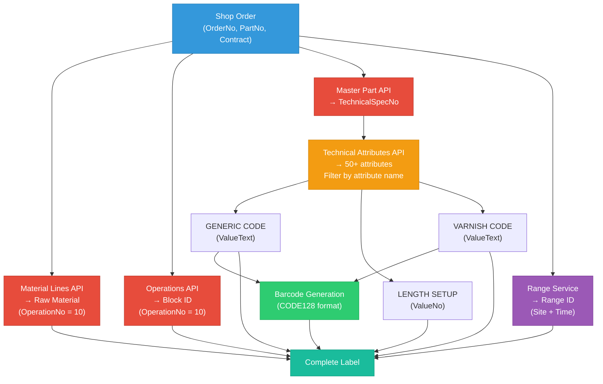

# Part Printer - Business Documentation V2

**Version**: 2.0  
**Date**: October 30, 2025  
**Developer**: Romain BOTTERO - Application Developer  
**Specification**: Marc TOCQUARD - IT Project Manager

---

## 📋 Table of Contents

1. [Overview](#1-overview)
2. [User Workflow (7 Steps)](#2-user-workflow-7-steps)
3. [Technical Data Flow](#3-technical-data-flow)
4. [Print Modes & Azure Integration](#4-print-modes--azure-integration)
5. [Error Handling System](#5-error-handling-system)

---

## 1. Overview

### Purpose

**Part Printer** is a web application for manufacturing wood parts that automates the generation and printing of labels and listing documents. It replaces manual processes by consolidating data from multiple IFS Cloud sources into ready-to-print PDF documents and IFS labels.

### Business Context

- **Target Users**: GAP Leaders, Supervisors
- **Use Case**: Print labels for wood parts (semi-finished products) at production sites
- **Sites**: BDR (Boatyard Rochefort), FR017, PRTBX, etc.
- **Form**: MA_FO_CR_184 (IFS Report for labels)
- **Interface**: MA_IN_EN_1543 (Azure Logic App for print jobs)

### Key Features

✅ **Filter shop orders** by site, date, production line, block ID  
✅ **3 print modes**: Listing Only, Labels Only, Listing + Labels  
✅ **PDF generation** (A4 landscape, multi-page with grouping)  
✅ **IFS printing** via Azure Print API (OAuth2 + retry logic)  
✅ **Error handling** system (blocking errors vs warnings)  
✅ **Data consolidation** from 5+ IFS endpoints per label

---

## 2. User Workflow (7 Steps)

### Step 1: Site Selection (Mandatory)

**Field**: Site (Contract)  
**Type**: List of Values (LOV) from IFS Contracts  
**Example**: "BDR", "FR017", "PRTBX"  
**API**: `GET /api/part-printer/sites`

**User Action**: Select the production site from the dropdown

**Error Handling**:
- If no sites retrieved → **PP_E001** (BLOCKING): "No Site data could be retrieved"
- Stops processing, user must contact support

---

### Step 2: Production Date (Mandatory*)

**Field**: Start Date  
**Type**: Calendar date picker  
**Format**: ISO date (YYYY-MM-DD)  
**Example**: "2025-10-13"

**User Action**: Select the production day for shop orders

**Business Rule**: Mandatory UNLESS Block ID (Step 4) is filled  
**Filter**: Filters shop orders by `RevisedStartDate`

---

### Step 3: Production Line (Optional)

**Field**: Production Line  
**Type**: LOV from IFS (filtered by selected site)  
**Example**: "Line 1", "CP", "M5"  
**API**: `GET /api/part-printer/production-lines?site={site}`

**User Action**: Optionally filter by specific production line

**Error Handling**:
- If no production lines retrieved → **PP_W002** (WARNING): "No Production Line data could be retrieved"
- Continues, but production line filter unavailable

**Business Rule**: 
- Dropdown disabled until Site is selected
- Optional filter (can leave empty)

---

### Step 4: Block ID (Optional)

**Field**: OP10 Block ID  
**Type**: Text input (alphanumeric)  
**Example**: "B25", "B89", "B92"

**User Action**: Optionally filter by specific operation Block ID

**Business Rule**: 
- If Block ID is filled → Date and Production Line become OPTIONAL
- Filters shop orders by `OperationBlockId` (Operation No = 10)
- Used for targeted label printing (specific block of parts)

---

### Step 5: Block Date Filter (Advanced Option)

**Field**: Block Date  
**Type**: Toggle (Enabled/Disabled) + Boolean (TRUE/FALSE)  
**Default**: Disabled

**User Action**:
1. Enable the filter (toggle)
2. Select TRUE or FALSE value

**Business Logic**:
- **Enabled + TRUE**: Filters shop orders with `CBlockDates = true` (classic cutting)
- **Enabled + FALSE**: Filters shop orders with `CBlockDates = false` (re-cutting)
- **Disabled**: No filter on Block Date field

**Typical Use Cases**:
- **Classic Cutting (Débit classique)**: Enabled + TRUE
- **Re-cutting (Redébit)**: Enabled + FALSE
- **All**: Disabled

---

### Step 6: Sent to Cutting System Filter (Advanced Option)

**Field**: Sent to Cutting System  
**Type**: Toggle (Enabled/Disabled) + Boolean (TRUE/FALSE)  
**Default**: Disabled

**User Action**:
1. Enable the filter (toggle)
2. Select TRUE or FALSE value

**Business Logic**:
- **Enabled + TRUE**: Only shop orders already sent to cutting system
- **Enabled + FALSE**: Only shop orders NOT sent to cutting system
- **Disabled**: No filter on this field

---

### Step 7: Print Mode Selection (Mandatory)

**Field**: Print Type  
**Type**: Radio buttons (3 options)  
**Options**:

| Mode | Description | Printer Required | Output |
|------|-------------|------------------|--------|
| **Listing Only** | Generate PDF listing only | ❌ No | PDF download (local) |
| **Labels Only** | Print labels to IFS printer | ✅ Yes | IFS print job (no PDF) |
| **Listing + Labels** | Both PDF and IFS printing | ✅ Yes | PDF download + IFS print |

**Printer Selection**:
- **Required for**: Labels Only, Listing + Labels
- **Type**: LOV from IFS Logical Printers
- **Example**: "PRTBX105_P", "PRTBX101"
- **API**: `GET /api/shared/printers`

**Error Handling**:
- If no printers retrieved → **PP_W003** (WARNING): "No logical printers could be retrieved"
- Forces **Listing Only** mode (labels unavailable)

**Button Behavior**:

```
┌─────────────────────────────────────────────────────────┐
│ Print Mode          │ Button Color │ Button Text        │
├─────────────────────────────────────────────────────────┤
│ Listing Only        │ 🔵 Blue      │ DOWNLOAD PDF       │
│ Labels Only         │ 🟢 Green     │ PRINT TO IFS       │
│ Listing + Labels    │ 🟣 Purple    │ PRINT & DOWNLOAD   │
└─────────────────────────────────────────────────────────┘
```

---

### Step 8: Generate/Print

**Action**: Click the dynamic button based on selected print mode

**Processing**:
1. Validate form fields (site, date, printer if required)
2. Call API to filter shop orders
3. Extract data from IFS (5+ endpoints per label)
4. Generate PDF (if Listing mode)
5. Send to Azure Print API (if Labels mode)
6. Display results or errors

---

### Step 9: Results Display

**Success**:
- **Listing Only**: PDF ready to download (opens in new tab)
- **Labels Only**: Confirmation message "X labels printed to {printer}"
- **Listing + Labels**: PDF download + print confirmation

**Preview** (collapsible section):
- Shows filtered shop orders
- Displays: Order No, Part No, Contract, Status
- Count: "X Shop Orders found"

---

## 3. Technical Data Flow

### 3.1 Data Consolidation (5+ IFS Endpoints)

For EACH shop order, the system must query multiple IFS Cloud endpoints to build a complete label:



### 3.2 Label Data Structure

Each label contains:

**From Shop Order** (`ShopOrderHandling.svc`):
- `OrderNo`, `ReleaseNo`, `SequenceNo`
- `PartNo`, `Contract`
- `RevisedStartDate` (production date)
- `ProductionLine` (optional)

**From Operation 10** (`ShopOrd(...)/ShopOrdOperationArray`):
- `OperationBlockId` (Block ID for OP10)

**From Material Lines** (`ShopOrd(...)/MaterialArray`):
- `RawMaterial` (Part code, filtered by OperationNo = 10)

**From Master Part** (`PartCatalogHandling.svc/.../TechnicalSpecBothArray`):
- `GENERIC CODE` (ValueText) → Mandatory (PP_E004 if missing)
- `LENGTH SETUP` (ValueNo) → Mandatory (PP_E005 if missing)
- `VARNISH CODE` (ValueText) → Optional (PP_W004 if missing, uses "N/A")
- `EngineeringPartRev` (latest active revision)

**From Range Service** (site-specific time ranges):
- `RangeId` format: "DDD X" (e.g., "274 A")
- DDD = day of year
- X = letter based on time ranges (A/B/C/R from site configuration)

**Generated**:
- `Barcode` (CODE128): `{GenericCode}_{Revision}` (e.g., "1000014690_Rev_02")

### 3.3 PDF Generation Logic

**Format**: A4 Landscape (297mm x 210mm)

**Grouping**:
1. Group labels by `(RawMaterial, VarnishCode)` pair
2. Create 1 page per group
3. Sort labels within each group by `LengthSetup` descending

**Columns**:
| Range | Varnish | Raw Material | Shop Order | Generic Code | Length | Barcode | OP10 Block ID |
|-------|---------|--------------|------------|--------------|--------|---------|---------------|

**Pagination**:
- Insert page break when max lines reached
- Repeat header on each page
- Footer with page number

---

## 4. Print Modes & Azure Integration

### 4.1 Azure Print API Architecture

The **Labels Only** and **Listing + Labels** modes use the Azure Print API to send print jobs directly to IFS printers.

**Azure Print API Details**:
- **Endpoint**: `https://gbenapimgtaiscommondev.azure-api.net/manufacturing/print/execute/Print`
- **Authentication**: OAuth2 Client Credentials (Azure AD)
- **Token Caching**: 55 minutes (token valid 60 min)
- **Timeout**: 120 seconds (IFS generates labels)
- **Retry Logic**: 3 attempts with exponential backoff
- **Format**: JSON payload with `Selection` string

**OAuth2 Configuration**:
```bash
AZURE_PRINT_CLIENT_ID=1ed5fa70-9e6c-4bda-9540-32bd72c4b590
AZURE_PRINT_CLIENT_SECRET=<secret>
AZURE_PRINT_TENANT_ID=<tenant_id>
AZURE_PRINT_SCOPE=https://management.azure.com/.default
```

**API Request Payload**:
```json
{
  "Printer": "PRTBX105_P",
  "PrintModel": "BEN_MA_FO_CR_184.rdl",
  "Selection": "ORDER_NO=495642^RELEASE_NO=*^SEQUENCE_NO=*^;"
}
```

**Selection String Format**:
- Multiple shop orders separated by semicolons
- Wildcards `*` for ReleaseNo and SequenceNo (print all)
- Example: `"ORDER_NO=495642^RELEASE_NO=*^SEQUENCE_NO=*^;ORDER_NO=495643^RELEASE_NO=*^SEQUENCE_NO=*^;"`

### 4.2 Print Mode Workflows

#### Mode 1: Listing Only 📄

```
1. User selects "Listing Only"
2. Fills: Site + Date (no printer required)
3. Clicks BLUE button "DOWNLOAD PDF"
4. System:
   → Filters shop orders
   → Consolidates data (5+ endpoints per order)
   → Generates PDF (A4 landscape, grouped)
5. PDF opens in new tab (user can download/print locally)
6. ✅ NO IFS print job sent
```

#### Mode 2: Labels Only 🖨️

```
1. User selects "Labels Only"
2. Fills: Site + Date + Printer (mandatory)
3. Clicks GREEN button "PRINT TO IFS"
4. System:
   → Filters shop orders
   → Generates Selection string
   → Calls Azure Print API (OAuth2)
   → Sends job to IFS printer
5. Confirmation: "X labels printed to {printer}"
6. ✅ NO PDF generated
```

#### Mode 3: Listing + Labels 🎯

```
1. User selects "Listing + Labels"
2. Fills: Site + Date + Printer (mandatory)
3. Clicks PURPLE button "PRINT & DOWNLOAD"
4. System:
   → Filters shop orders
   → Consolidates data
   → Generates PDF (parallel)
   → Calls Azure Print API (parallel)
5. Results:
   → PDF opens in new tab
   → Confirmation: "X labels printed to {printer}"
6. ✅ Both PDF and IFS print job
```

### 4.3 Azure Print Service Features

**Token Caching**:
- Tokens cached for 55 minutes (5 min safety margin)
- Automatic renewal on expiration
- Reduces OAuth2 calls

**Retry Logic**:
- 3 attempts with exponential backoff (1s, 2s, 4s)
- Handles transient network errors
- Logs each retry attempt

**Error Handling**:
- **PP_E006** (BLOCKING): "Azure Print API failed" if all retries fail
- Detailed error message with context (printer, shop order count)
- Logged to Error Service for tracking

---

## 5. Error Handling System

### 5.1 Error Classification

Part Printer uses a centralized error system with **error codes** and **severity levels**:

**Error Code Format**: `PP_[E|W][XXX]`
- `E` = Error (blocking)
- `W` = Warning (continue)
- `XXX` = Sequential number

**Severity Levels**:
- 🛑 **BLOCKING**: Stops processing, user must fix the issue
- ⚠️ **WARNING**: Continues with degraded functionality or default values
- ℹ️ **INFO**: Informational message, no impact

### 5.2 Blocking Errors (PP_E001 - PP_E006)

| Code | Trigger | Message | User Action |
|------|---------|---------|-------------|
| **PP_E001** | No sites retrieved from IFS | "No Site data could be retrieved" | Contact support |
| **PP_E002** | No shop orders match filters | "No Shop Orders found" | Adjust filters |
| **PP_E003** | Raw Material not found (OP10) | "Missing Raw Material data for order {orderNo}" | Check IFS data |
| **PP_E004** | Generic Code attribute missing | "Missing Generic Code (mandatory attribute)" | Configure in IFS |
| **PP_E005** | Length Setup attribute missing | "Missing Length Setup (mandatory attribute)" | Configure in IFS |
| **PP_E006** | Azure Print API call failed | "Azure Print API failed: {error}" | Retry or contact IT |

**Blocking Behavior**:
- **Stops processing immediately**
- Displays error dialog with code and message
- Logs error with stack trace
- User must fix the issue before proceeding

### 5.3 Warning Errors (PP_W001 - PP_W004)

| Code | Trigger | Message | Degraded Behavior |
|------|---------|---------|-------------------|
| **PP_W001** | No ranges for site | "No Range data available for this site" | Uses "N/A" for Range ID |
| **PP_W002** | No production lines | "No Production Line data could be retrieved" | Production line filter disabled |
| **PP_W003** | No logical printers | "No logical printers could be retrieved" | Forces **Listing Only** mode |
| **PP_W004** | Varnish Code missing | "No Varnish Code found for part" | Uses "N/A" as default |

**Warning Behavior**:
- **Continues processing with degradation**
- Displays warning toast/banner
- Logs warning with details
- Uses default values where applicable

### 5.4 Error Service Architecture

**Error Service** (`error-service.ts`):
- Centralized error handling
- Error history tracking (last 100 errors)
- Logging with severity-based formatting
- Stop/continue decision logic

**Error Type** (`error.ts`):
```typescript
interface PartPrinterError {
  code: ErrorCode           // PP_E001, PP_W002, etc.
  severity: ErrorSeverity   // BLOCKING, WARNING, INFO
  message: string           // User-friendly message
  details?: Record<string, any>  // Context (orderNo, filters, etc.)
  action: ErrorAction       // STOP, CONTINUE, DEFAULT
  timestamp?: Date
  stack?: string            // Stack trace (debug)
}
```

**Usage Example**:
```typescript
// Create blocking error
const error = errorService.createError(
  ErrorCode.NO_GENERIC_CODE,
  { partNo: "AN29-13-00", orderNo: "495642" }
)

// Handle error (logs + decides to stop)
const shouldStop = errorService.handleError(error)

if (shouldStop) {
  // Display error dialog + stop processing
}
```

### 5.5 Error Display (UI)

**Blocking Errors**:
- 🔴 **Error Dialog**: Modal with error code, message, and details
- ❌ **Red banner**: At top of page until dismissed
- **No results**: Processing stops, no PDF/labels generated

**Warning Errors**:
- 🟡 **Warning Toast**: Auto-dismiss after 5 seconds (top-right corner)
- ⚠️ **Yellow banner**: Persistent until user acknowledges
- **Degraded mode**: Feature disabled or default value used

**Error History**:
- Accessible via "Error Log" button (dev mode)
- Shows last 100 errors with timestamps
- Filterable by severity
- Exportable to JSON

---

## 6. Technical Specifications

### 6.1 IFS APIs Used

| API | Endpoint | Usage |
|-----|----------|-------|
| **Sites** | `CompanySiteHandling.svc/CompanySiteSet` | List of contracts (BDR, FR017, etc.) |
| **Production Lines** | `ProductionLineHandling.svc/ProductionLineSet` | Filter by site |
| **Shop Orders** | `ShopOrderHandling.svc/ShopOrds` | Filter by site, date, line, block date |
| **Operations** | `ShopOrd(...)/ShopOrdOperationArray` | Get Block ID for OP10 |
| **Material Lines** | `ShopOrd(...)/MaterialArray` | Get Raw Material (OP10) |
| **Master Part** | `PartCatalogHandling.svc/.../TechnicalSpecBothArray` | Get technical attributes (50+ per part) |
| **Ranges** | `CompanySite(...)/SiteMfgstdRangeArray` | Time-based ranges per site |
| **Printers** | `PrintDialogHandling.svc/LogicalPrinters` | List of IFS logical printers |

### 6.2 Technology Stack

| Component | Technology | Version |
|-----------|------------|---------|
| **Framework** | Next.js | 15.2.1 |
| **Language** | TypeScript | 5.8.2 |
| **UI** | shadcn/ui + Tailwind CSS | 4.1.7 |
| **PDF Generation** | jsPDF | Latest |
| **Barcode** | JsBarcode | Latest |
| **HTTP Client** | Axios | 1.13.1 |
| **IFS Integration** | OData + OAuth2 | - |

### 6.3 Performance Considerations

**Parallel Processing**:
- Shop orders filtered once (batch)
- Data extraction per order (sequential to avoid IFS overload)
- PDF generation and Azure Print API can run in parallel (Listing + Labels mode)

**Caching**:
- **OAuth2 tokens**: 55 min cache (Azure Print API)
- **IFS tokens**: 55 min cache (IFS OData API)
- **Sites/Printers**: Client-side cache (session)

**Timeouts**:
- **Shop Order filter**: 30 seconds
- **Data extraction**: 10 seconds per endpoint
- **PDF generation**: 60 seconds
- **Azure Print API**: 120 seconds (IFS label generation time)

---

## 7. Deployment & Configuration

### 7.1 Environment Variables

```bash
# IFS Cloud OAuth2
IFS_BASE_URL=https://beneteau-group-ast.ifs.cloud/main/ifsapplications/projection/v1
IFS_CLIENT_ID=AIS_IFS_MA_AST
IFS_CLIENT_SECRET=<secret>
IFS_TOKEN_URL=https://beneteau-group-ast.ifs.cloud/auth/realms/beneast1/protocol/openid-connect/token

# Azure Print API OAuth2
AZURE_PRINT_CLIENT_ID=1ed5fa70-9e6c-4bda-9540-32bd72c4b590
AZURE_PRINT_CLIENT_SECRET=<secret>
AZURE_PRINT_TENANT_ID=<tenant_id>
AZURE_PRINT_SCOPE=https://management.azure.com/.default

# Azure Print API Endpoint
AZURE_PRINT_API_URL=https://gbenapimgtaiscommondev.azure-api.net/manufacturing/print/execute/Print
AZURE_PRINT_SUBSCRIPTION_KEY=c5dcb4c8fdf34250b33a5988b269fb8d;product=erpboat
```

### 7.2 Access Control

**User Groups** (managed in Manufacturing Portal):
- GAP Leaders
- Supervisors
- Administrators (IT)

**Permissions**:
- View: Access Part Printer interface
- Execute: Generate listings and print labels
- Admin: View error logs and system diagnostics

**Authentication**: Azure AD SSO (if enabled for portal)

---

## Conclusion

**Part Printer** is a complex data orchestration tool that consolidates information from 5+ IFS Cloud endpoints to generate production labels and listings. Key achievements:

✅ **Automated workflow**: Replaces manual IFS navigation  
✅ **3 print modes**: Flexibility for different use cases  
✅ **Robust error handling**: Clear distinction between blocking errors and warnings  
✅ **Azure integration**: Direct printing to IFS printers via cloud API  
✅ **PDF generation**: Professional A4 landscape documents with grouping/sorting

**Next Steps**:
- User acceptance testing (UAT) at BDR site
- Performance testing with 100+ shop orders
- Integration with Dataprivilège for permission management
- Deployment to production (November 2025)

---

**Developer**: Romain BOTTERO - Application Developer  
**Specification**: Marc TOCQUARD - IT Project Manager  
**Last Update**: October 30, 2025  
**Version**: 2.0
