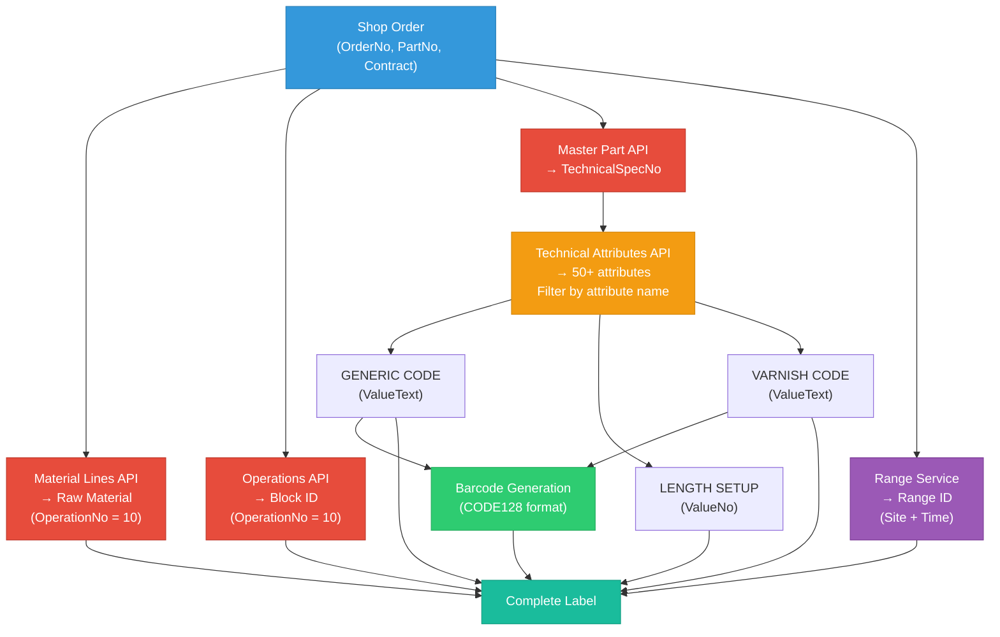

# Mermaid Diagram - Part Printer Data Flow

**Instructions**: Copier ce code dans un éditeur Mermaid en ligne (https://mermaid.live) pour générer le diagramme, puis exporter l'image et l'insérer dans Word.

## Alternative: Lien direct Mermaid Live

https://mermaid.live/edit#pako:eNqNVE1v2zAM_SuETgXWJm2TJT70tAPWdV2BZoFXDDsIsSxXqCwZkpx1QPLfR8lO0rTLeukkU-TjI_n4xA5GGmjo3qBLhNOa4AYJb5ggQUq0Rq2RcktEaYVaI-VEaYVaI-VEaYVaI-VEaYVaI-VEaYVaI-VEaYVaI-VEaYVaI-VEaYVaI-VEaYVaI-VEaYVaI-VEaYVaI-VEaYVaI-VEaYVaI-VEaYVaI-VEaYVaI-VEaYVaI-VEaYVaI-VEaYVaI-VEaYVaI-VEaYVaI-VEaYVaI-VEaYVaI-VEaYVaI-VEaYVaI-VEaYVaI-VEaYVaI-VEaYVaI-VEaYVaI-VEaYVaI-VEaYVaI-VEaYVaI-VEaYVaI-VEaYVaI-VEaYVaI-VEaYVaI-VEaYVaI-VEaYVaI-VEaYVaI-VEaYVaI-VEaYVaI

## Comment l'insérer dans Word

1. Ouvrir https://mermaid.live
2. Copier-coller le code Mermaid ci-dessus
3. Cliquer sur "Export" → "PNG" ou "SVG"
4. Télécharger l'image
5. Dans Word Online: Insertion → Images → Télécharger depuis ce périphérique
6. Positionner l'image dans la section "3. Data Consolidation"
