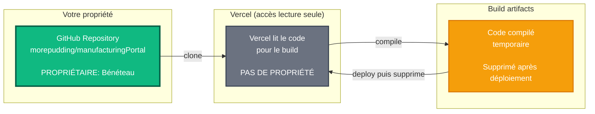
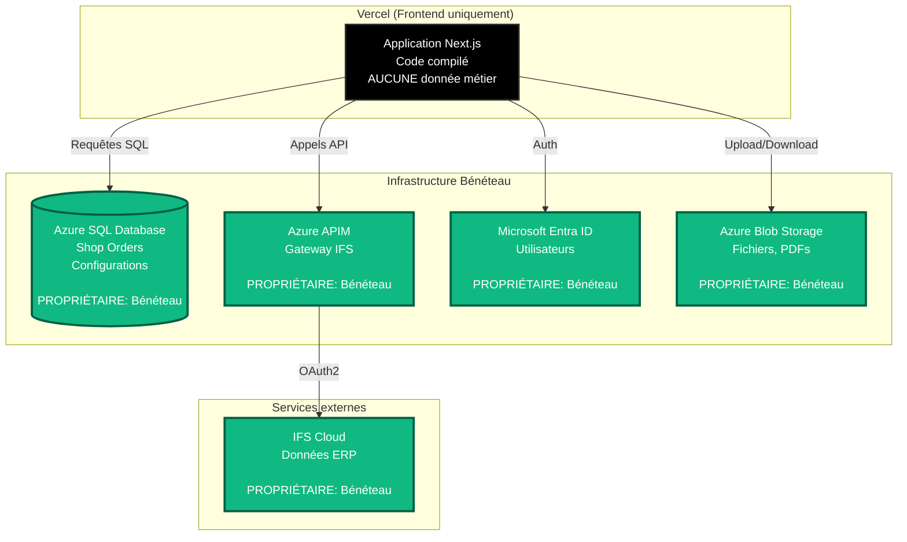
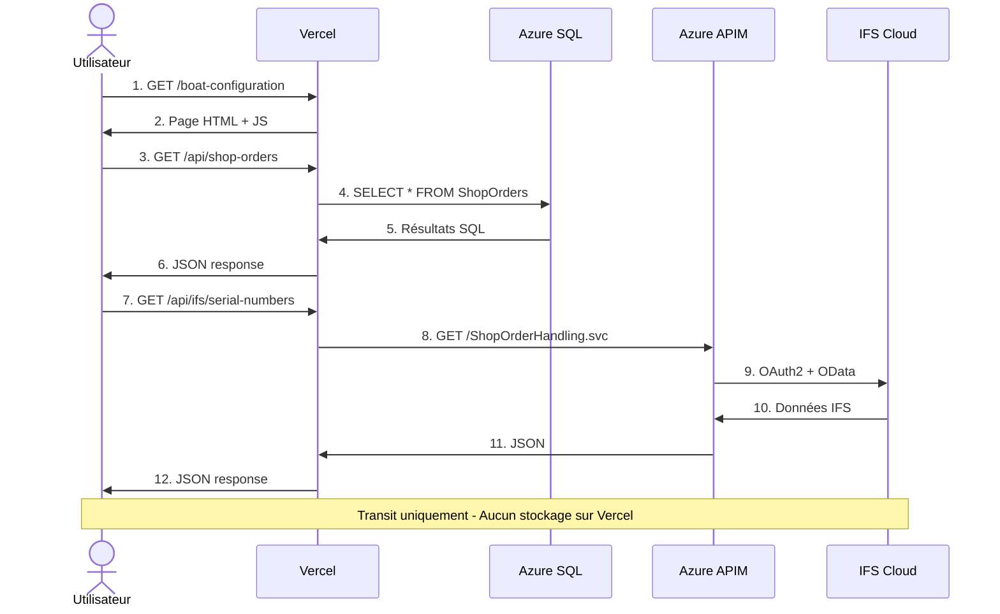
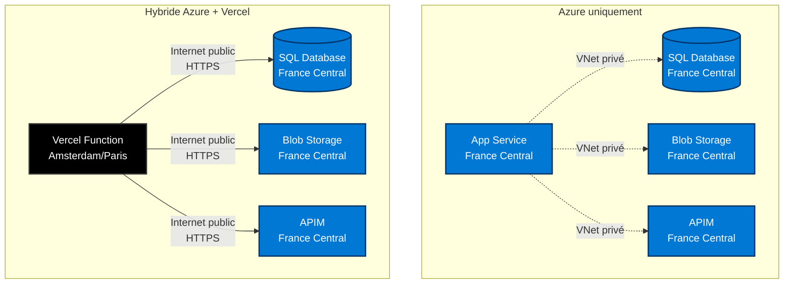
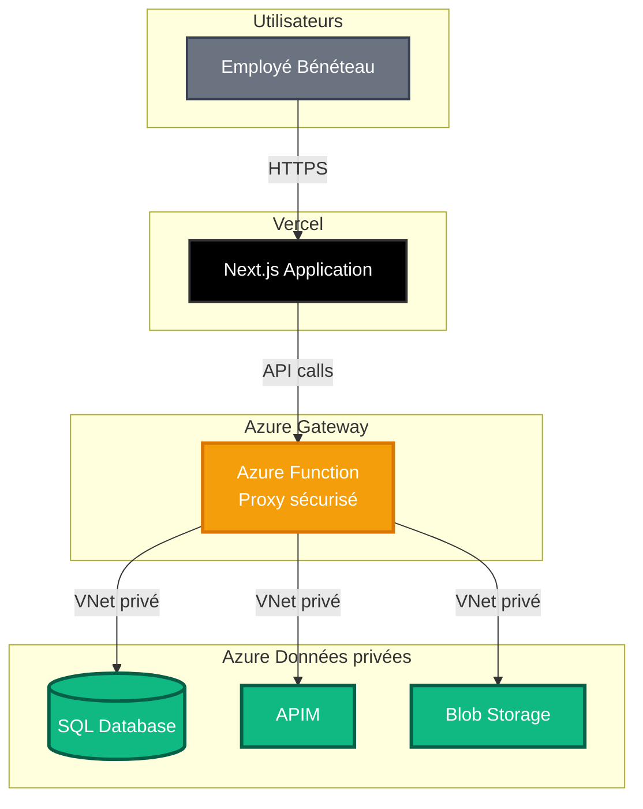

# Vercel : Propriété, Sécurité et Flux des Données

> Document technique expliquant où vont les données, qui en est propriétaire, et comment les flux de données fonctionnent avec Vercel

---

## 📋 Table des matières

1. [Propriété du code et des données](#propriété-du-code-et-des-données)
2. [Flux des données](#flux-des-données)
3. [Ce que Vercel voit et stocke](#ce-que-vercel-voit-et-stocke)
4. [Sécurité et conformité](#sécurité-et-conformité)
5. [Comparaison avec Azure](#comparaison-avec-azure)
6. [Recommandations (optionnel)](#recommandations-optionnel)

---

## 🔐 Propriété du code et des données

### Votre code source

**Question** : Est-ce que je reste propriétaire de mon code ?

**Réponse** : **OUI, complètement**



**Process Vercel** :
1. **Lecture** : Se connecte à GitHub (permission lecture seule)
2. **Build** : Compile le code temporairement
3. **Déploiement** : Copie les fichiers compilés (HTML, JS, CSS) vers CDN
4. **Suppression** : Le code source n'est PAS conservé

**Propriété intellectuelle** :
- Bénéteau garde 100% des droits
- Vercel ne peut pas utiliser, vendre ou partager le code
- Possibilité de quitter Vercel à tout moment

> 📄 **Source** : [Vercel Terms of Service - Section 6](https://vercel.com/legal/terms) - "You retain all rights to your content and code"

---

### Vos données applicatives

**Question** : Où sont stockées mes données (base de données, fichiers) ?

**Réponse** : **Chez Bénéteau (Azure/IFS uniquement)**



**État actuel** :
- Vercel héberge uniquement le code frontend compilé (HTML/JS/CSS) [¹](#sources)
- AUCUNE donnée métier stockée sur Vercel (architecture serverless sans persistance) [²](#sources)
- Toutes les données restent sur Azure SQL, IFS Cloud et Azure Storage [³](#sources)

> 📄 **Sources** :
> - [Vercel Edge Network](https://vercel.com/docs/edge-network/overview) - "Static assets and server-rendered pages are cached and served from our global Edge Network"
> - [Vercel Functions](https://vercel.com/docs/functions) - "Functions are stateless and ephemeral by design. They do not persist data between invocations"
> - [Vercel Storage Guide](https://vercel.com/docs/storage) - "Vercel does not include a built-in database. Connect to external databases like PostgreSQL, MySQL, or MongoDB hosted elsewhere"

---

## 🔄 Flux des données

### Exemple : Affichage d'une page



**Comportement** :
- Frontend servi depuis le CDN Vercel (Edge Network) [⁴](#sources)
- API calls exécutés par Serverless Functions Vercel (compute sans état) [⁵](#sources)
- Données transitent en mémoire uniquement (durée d'exécution de la fonction) [⁶](#sources)
- Aucun stockage permanent sur Vercel (pas de base de données intégrée par défaut) [⁷](#sources)
- Toutes les données restent sur Azure/IFS (connexions externes via HTTPS) [³](#sources)

> 📄 **Sources** :
> - [Edge Network Caching](https://vercel.com/docs/edge-network/caching) - "Content is distributed across 100+ global edge locations"
> - [Serverless Functions](https://vercel.com/docs/functions/runtimes) - "Functions execute on-demand without managing servers"
> - [Function Lifecycle](https://vercel.com/docs/functions/runtimes#runtime-lifecycle) - "Each function invocation is isolated and short-lived. Memory state is not shared between invocations"
> - [File System](https://vercel.com/docs/functions/runtimes#file-system) - "The filesystem is read-only except for /tmp which is cleared between invocations"

---

## 👁️ Ce que Vercel voit et stocke

### Tableau de synthèse

| Type de donnée | Vercel voit ? | Vercel stocke ? | Durée conservation |
|---|---|---|---|
| **Code source** | Oui (pendant build) | Non | Supprimé après build |
| **Code compilé** | Oui | Oui | Permanent (tant que déployé) |
| **Variables d'env** | Oui (chiffrées) | Oui (chiffrées) | Permanent |
| **Logs d'exécution** | Oui | Oui | 24 heures (Pro) / 1 heure (Hobby) |
| **Métriques performance** | Oui | Oui | 30 jours |
| **Données SQL** | Non (transit) | Non | Jamais |
| **Données IFS** | Non (transit) | Non | Jamais |
| **Fichiers uploadés** | Non | Non | Jamais |
| **Données utilisateurs** | Non (transit) | Non | Jamais |

### Contenu des logs Vercel

**Exemple** :
```
2025-11-13 14:23:45 | GET /api/shop-orders | 200 | 234ms
2025-11-13 14:23:46 | GET /api/ifs/serial-numbers?orderId=563 | 200 | 1823ms
2025-11-13 14:23:50 | POST /api/print | 200 | 456ms
```

**Vercel voit** : URL, méthode HTTP, statut, temps d'exécution, IP utilisateur [⁸](#sources)

**Vercel NE voit PAS** : Contenu SQL, données API, mots de passe, tokens, fichiers [⁹](#sources)

> 📄 **Sources** :
> - [Runtime Logs](https://vercel.com/docs/observability/runtime-logs) - "Logs include request URL, method, status code, duration, and IP address"
> - [Security & Compliance](https://vercel.com/security) - "We do not log request or response bodies. Environment variables are encrypted at rest (AES-256-GCM)"

---

## 🛡️ Sécurité et conformité

### Chiffrement

**En transit** :
```
Utilisateur ─[HTTPS/TLS 1.3]─> Vercel ─[HTTPS/TLS 1.3]─> Azure SQL
                                       └─[HTTPS/TLS 1.3]─> Azure APIM
```
- Chiffrement bout-en-bout
- Certificats SSL automatiques (Let's Encrypt)
- TLS 1.3

**Au repos** :
- Variables d'environnement : AES-256
- Code compilé : Chiffré sur CDN
- Logs : AES-256

> 📄 **Source** : [Vercel Security Whitepaper](https://vercel.com/security) - "TLS 1.3 for data in transit, AES-256 for data at rest"

### Certifications

| Certification | Status |
|---|---|
| **SOC 2 Type II** | ✅ Certifié |
| **ISO 27001** | ✅ Certifié |
| **GDPR** | ✅ Conforme |
| **CCPA** | ✅ Conforme |

> 📄 **Sources** :
> - [Vercel Trust Center](https://vercel.com/security) - Certifications SOC 2 & ISO 27001 actives et vérifiables
> - [Privacy Policy](https://vercel.com/legal/privacy-policy) - "We are compliant with GDPR and process data according to EU regulations"

### Localisation géographique

**Vercel Functions** :
- Régions disponibles : US East/West, Europe (Amsterdam, Dublin, Frankfurt), Asia Pacific
- Configuration possible : Forcer Europe uniquement

**Azure (inchangé)** :
- France Central / West Europe
- Pas de transfert hors UE
- Conformité RGPD garantie

---

## ⚖️ Comparaison avec Azure

### Architecture réseau



### Tableau comparatif

| Aspect | Azure uniquement | Hybride Azure + Vercel |
|---|---|---|
| **Propriétaire données** | Bénéteau | Bénéteau |
| **Localisation données** | France/Europe | France/Europe (Azure) |
| **Réseau** | VNet privé | Internet public (HTTPS) |
| **Logs applicatifs** | Azure Monitor (30-90j) | Vercel (24h) + Azure Monitor |
| **Accès admin** | Équipe IT Bénéteau | Équipe IT Bénéteau |
| **Accès tiers** | Aucun | Vercel (logs transit) |
| **Conformité RGPD** | ✅ Total | ✅ Total (données en EU) |
| **Audit trail** | Azure AD + Monitor | Azure AD + Vercel logs |
| **Backup données** | Azure Backup | Azure Backup (inchangé) |

**Constat** : Avec Vercel, les données métier restent à 100% chez Bénéteau. Seul le frontend est externalisé.

---

## 📊 Recommandations (optionnel)

### Architecture sécurisée avec Gateway Azure

Si nécessaire, possibilité d'ajouter un proxy Azure pour isoler complètement les accès :



**Avantages** :
- Base de données reste en VNet privé
- Vercel ne connaît jamais les credentials Azure
- Contrôle total via le Gateway

### Gestion des secrets

**Configuration minimale** :
```typescript
// Dans Vercel
AZURE_GATEWAY_URL=https://beneteau-gateway.azurewebsites.net
AZURE_GATEWAY_KEY=<clé publique rotatable>

// Dans Azure Gateway
DATABASE_CONNECTION_STRING=<connection complète>
IFS_CLIENT_SECRET=<secret OAuth2>
APIM_SUBSCRIPTION_KEY=<clé APIM>
```

### Plan de sortie

Si nécessaire de quitter Vercel :

1. **< 1h** : Supprimer déploiement + révoquer accès GitHub
2. **1-2 jours** : Déployer sur Azure App Service + changer DNS
3. **1 semaine** : Audit logs + suppression projet Vercel

**Aucune donnée perdue** (tout reste sur Azure).

---

## 🎯 Résumé

**Propriétaire du code ?** → Bénéteau 100%

**Localisation des données ?** → Azure France/Europe

**Vercel voit les données ?** → Non, transit uniquement

**Conforme RGPD ?** → Oui

**Réversible ?** → Oui, facilement

**Verdict** : Vercel adapté pour POCs/tests. Données métier restent chez Bénéteau.

---

##  Documentation complémentaire

**Architecture Next.js sur Vercel** :
- [Next.js Deployment](https://nextjs.org/docs/deployment)
- [Vercel Platform Overview](https://vercel.com/docs/concepts)

**Sécurité et conformité** :
- [Vercel Security Documentation](https://vercel.com/docs/security)
- [GDPR Compliance Guide](https://vercel.com/guides/gdpr-compliance)

**Intégrations externes** :
- [Database Integration Guide](https://vercel.com/docs/storage/vercel-postgres)
- [Environment Variables Best Practices](https://vercel.com/docs/projects/environment-variables/managing-environment-variables)

