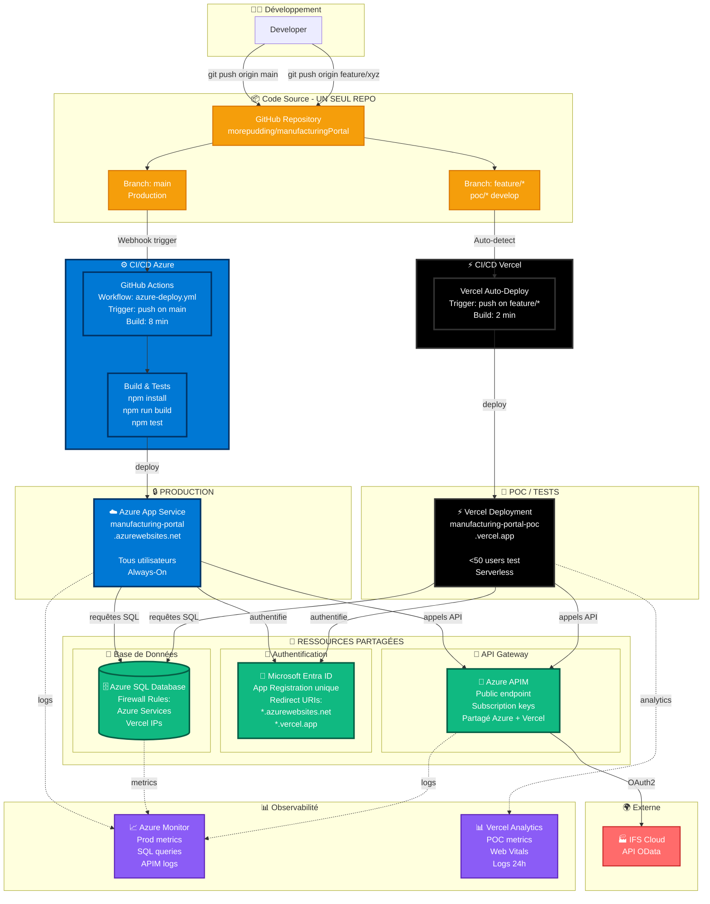

# Azure ↔️ Vercel : Stratégie de Complémentarité pour Bénéteau

> **Objectif** : Utiliser le Manufacturing Portal comme cas d'usage pour démontrer comment Vercel peut compléter Azure chez Bénéteau, particulièrement pour les POCs, petites apps et déploiements rapides de test.

---

## 📋 Table des matières

1. [Positionnement stratégique](#positionnement-stratégique)
2. [Différences techniques détaillées](#différences-techniques-détaillées)
3. [Flux de données et architecture](#flux-de-données-et-architecture)
4. [Propriété et sécurité des données](#propriété-et-sécurité-des-données)
5. [Stratégie de déploiement hybride](#stratégie-de-déploiement-hybride)
6. [Nouveautés Vercel 2024-2025](#nouveautés-vercel-2024-2025)
7. [Cas d'usage Manufacturing Portal](#cas-dusage-manufacturing-portal)

---

## 🎯 Positionnement stratégique

### Vision : Complémentarité, pas remplacement

```
┌─────────────────────────────────────────────────────────────────┐
│                    ÉCOSYSTÈME BÉNÉTEAU                          │
└─────────────────────────────────────────────────────────────────┘

╔═══════════════════════╗              ╔═══════════════════════╗
║   AZURE (Production)  ║              ║   VERCEL (Innovation) ║
║   ─────────────────   ║              ║   ──────────────────  ║
║                       ║              ║                       ║
║ • Apps critiques      ║              ║ • POCs rapides        ║
║ • Infrastructure      ║              ║ • Prototypes          ║
║   complexe            ║              ║ • Apps de test        ║
║ • Compliance stricte  ║              ║ • Démos clients       ║
║ • Long-running tasks  ║              ║ • Expérimentations    ║
║ • VNet privé          ║              ║ • Dev/Preview URLs    ║
║ • Managed Identity    ║              ║ • Itérations rapides  ║
║                       ║              ║                       ║
║ Setup: 1-2 jours      ║              ║ Setup: 30 min         ║
╚═══════════════════════╝              ╚═══════════════════════╝
         │                                      │
         └──────────────────┬───────────────────┘
                            │
                    Mêmes ressources :
                    • Azure APIM (IFS)
                    • Azure SQL DB
                    • Microsoft Entra ID
                    • Azure Storage
```

### Cas d'usage idéaux

| Critère | Azure | Vercel |
|---------|----------|-----------|
| **App en production** (>1000 users) | Recommandé | Possible |
| **POC / Prototype** (<50 users) | Overkill | Parfait |
| **Démo client** (temporaire) | Trop lent à setup | URL en 5 min |
| **Tests A/B rapides** | Complexe | Preview URLs |
| **App critique 24/7** | Recommandé | Cold starts |
| **Long-running jobs** (>60s) | Oui | Non (timeout) |
| **VNet privé requis** | Oui | Non |
| **Dev rapide** | CI/CD à configurer | Push = deploy |

---

## 🔍 Différences techniques détaillées

### 1. ❌ Ce que Vercel NE PEUT PAS faire (Azure only)

#### A. **Managed Identity** - Authentification automatique

**Azure Managed Identity** :
Azure reconnaît automatiquement votre application et lui donne accès aux services (base de données, API) sans avoir besoin de mots de passe.

**En pratique** :
- ✅ **Azure** : Pas de mots de passe à stocker, Azure gère l'authentification automatiquement
- ❌ **Vercel** : Doit obligatoirement stocker les mots de passe et identifiants dans la configuration
- ⚠️ **Sécurité Vercel** : Les mots de passe sont chiffrés, mais ils existent et peuvent être volés

**Conséquence pour Bénéteau** :
- Sur Azure : Si un hacker accède à votre code, il ne trouve aucun mot de passe
- Sur Vercel : Les mots de passe sont dans la configuration, risque supérieur

---

#### B. **Synthèse des différences Azure vs Vercel**

| Fonctionnalité | Azure | Vercel | Impact Bénéteau |
|---|---|---|---|
| **Réseau privé (VNet)** | Isolé, communication interne sans Internet | Tout passe par Internet public | Azure plus sécurisé, Vercel nécessite firewall |
| **Authentification base de données** | Managed Identity (pas de mots de passe) | Mots de passe obligatoires dans config | Azure élimine le risque de vol de credentials |
| **Connexion Azure SQL** | Directe via VNet | Via firewall (liste IPs Vercel à maintenir) | **Solution** : API proxy sur Azure |
| **Surveillance/Monitoring** | Azure Monitor (tout centralisé) | Dispersé (logs 24h, outils externes) | Azure facilite le debugging |
| **Authentification users** | Easy Auth (config visuelle, 5 min) | NextAuth.js (~100 lignes code, 1-2h) | Azure plus rapide, Vercel plus flexible |
| **Performance** | Always-On (50ms constant) | Serverless (1ère visite 800-1500ms puis 50ms) | Vercel adapté aux POCs intermittents |
| **Timeout API** | Illimité | 60 secondes maximum | Jobs longs doivent passer par Azure |
| **Taille fichiers** | Illimité | 50 MB maximum | Upload direct vers Azure Blob Storage |

**Conclusion pour Manufacturing Portal** :
- Opérations < 5 secondes : Aucun problème sur Vercel
- POCs avec trafic intermittent : Démarrage lent acceptable (1-2s première fois)
- Données sensibles : API proxy Azure recommandée pour isoler la base de données

---

## 🔄 Flux de données et architecture

### Architecture hybride Azure + Vercel (Recommandé Bénéteau)



**Avantages de cette architecture** :
- **UN SEUL REPO** : Code partagé, pas de duplication
- **Déploiement automatique** : Pas d'intervention manuelle selon la branche
- **Ressources partagées** : Azure AD, SQL, APIM utilisés par les deux
- **Preview URLs automatiques** : Chaque branche feature = URL de test unique
- **CI/CD Azure robuste** : Tests automatiques avant production
- **Flexibilité** : Production stable (Azure) + Innovation rapide (Vercel)

---

Je continue avec la partie suivante sur la propriété des données et la sécurité ?